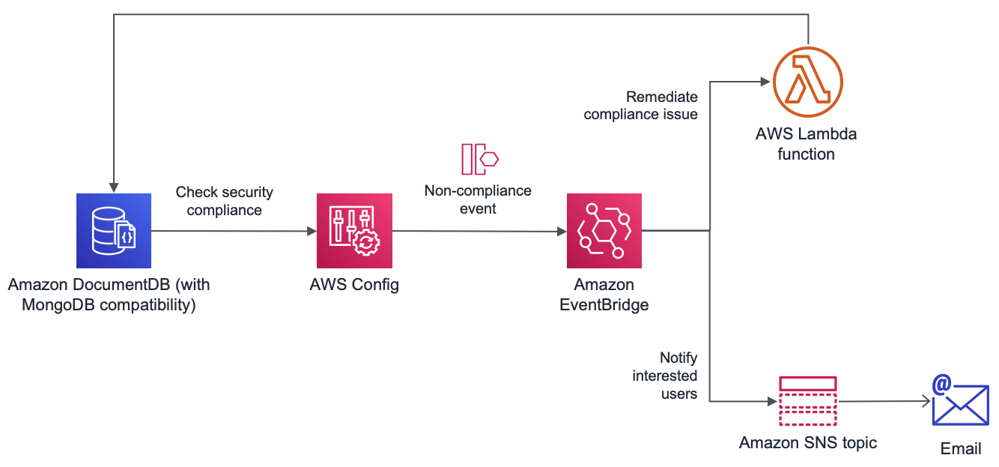

# Ensuring compliance best practices for Amazon Document with AWS Config

[Amazon DocumentDB (with MongoDB compatibility)](https://aws.amazon.com/documentdb/) is a fast, scalable, highly available, and fully managed document database service that supports MongoDB workloads. You can use the same MongoDB 3.6 and 4.0 application code, drivers, and tools to run, manage, and scale workloads on Amazon DocumentDB without worrying about managing the underlying infrastructure. As a document database, Amazon DocumentDB makes it easy to store, query, and index JSON data.

When you run your wokloads on top of DocumentDB, you do so in the form of clusters, whose number of instances varies from 1 (single primary node) to 16 (1 primary plus up to 15 read replicas).

Many businesses need to comply with different regulations to achieve security and audit certifications according to the sectors they operate in. When working with DocumentDB resources, [AWS Config](https://aws.amazon.com/config/) allows you to create rules around how aforementioned resources should be configured. Every time a configuration change takes place, these rules are re-evaluated to ensure they remain compliant with your organisation requirements.

Aditionally, every time an AWS Config rule goes to a non-compliant status, the service puts an event on the default bus of [Amazon EventBridge](https://aws.amazon.com/eventbridge/). This gives the opportunity to automate the remediation of non-compliant configuration changes. For instance, if a DocumentDB cluster had Deletion Protection disabled, we could have an [AWS Lambda](https://aws.amazon.com/lambda/) function listening to the corresponding event, so we can enable it back with no manual intervention.

This repository contains a set of [AWS Config managed](https://docs.aws.amazon.com/config/latest/developerguide/evaluate-config_use-managed-rules.html) and [custom rules](https://docs.aws.amazon.com/config/latest/developerguide/evaluate-config_develop-rules.html) that we can configure around DocumentDB resources to permanently evaluate their compliance alongside automated remediation for some of them.



The AWS Config rules provisioned are:

- Detection protection enabled
- Storage encrypted
- Cluster instances to have the same instance family and size
- Parameter group
- Backup retention policy

Resources are provisioned using the [AWS CDK framework](https://docs.aws.amazon.com/cdk/latest/guide/home.html) using Typescript. They should serve as a starting point and every organisation can modify/extend the resources in this CDK application to match their needs.

## Requirements

- Node.js 14.16.0 or above.
- npm 7 or above.
- [AWS CDK toolkit](https://docs.aws.amazon.com/cdk/latest/guide/cli.html) 1.95.1.
- [AWS CLI](https://docs.aws.amazon.com/cli/latest/userguide/cli-chap-configure.html). You must have run `aws configure` to set up your terminal for the AWS account and region of your choice.

## Deployment

- [Enable AWS Config](https://docs.aws.amazon.com/config/latest/developerguide/gs-console.html) for the account and region where rules will be deployed to.
- Only for the first time, [boostrap](https://docs.aws.amazon.com/cdk/latest/guide/bootstrapping.html) the target environment (AWS account and region) where you will be provisioning the CDK app resources:
  
  ```bash
  export ACCOUNT_ID=$(aws sts get-caller-identity --query 'Account' --output text)
  export AWS_REGION=$(aws configure get region)

  cdk bootstrap aws://$ACCOUNT_ID/$AWS_REGION
  ```

- From the root of the project, install dependencies, compile and deploy:

  ```bash
  npm i
  npm run build
  cdk deploy
  ```

  After confirming that there will be security-related changes, the provisioning of the Amazon CloudFormation template will start. You can monitor its progress directly from the terminal or through the AWS web console.

There will be two Config custom rules whose correct behaviour will depend on each organisation requirements: parameter group and backup retention policy. By default, the application expects DocumentDB clusters to have a parameter group called `blogpost-param-group` and a minimun backup retention window of 7 days.

These values can be easily overriden with the ones matching your organisation's needs. To do so, go to `bin/amazon-documentdb-aws-config.ts` and perform the following change:

```typescript
new AmazonDocumentdbAwsConfigStack(app, 'AmazonDocumentDbAwsConfigStack', {
  backupRetentionPeriod: <your-backup-retention-period>,
  clusterParameterGroup: '<your-parameter-group>'
});
```

Save the file and deploy the changes:

```bash
npm run build
cdk deploy
```

Every time a Config rule goes non-compliant, an event is published to an Amazon SNS topic through Amazon EventBridge. You can [add subscriptions to that topic](https://docs.aws.amazon.com/sns/latest/dg/sns-create-subscribe-endpoint-to-topic.html) so other interested parties can be notified when these events happen.

## Clean up

Run the following command in your terminal to destroy the pipeline stack:

```bash
cdk destroy 
```

Be aware some resources will not be removed as part of the deletion operation and they will have to be deleted manually: CloudWatch log group.
