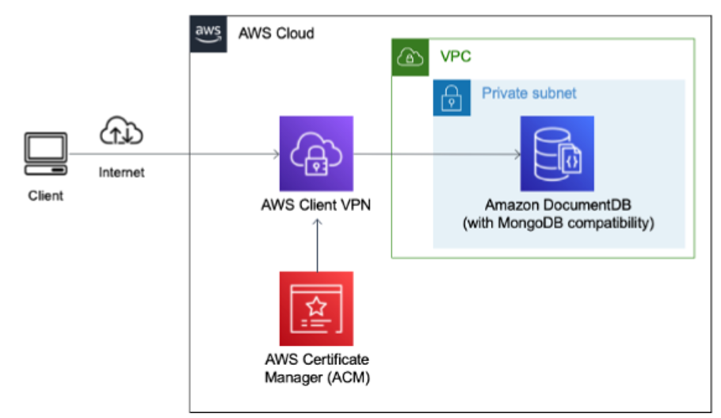

**Securely access Amazon DocumentDB (with MongoDB compatibility) locally
using AWS Client VPN**

**Overview**

In this section, we provide the steps to launch the CloudFormation
template that helps in automating the provisioning of some of the
resources as discussed on the blog \<blog link here\>.

**Architecture diagram**

After you finish the steps outlined on this readme, you will have the
Client VPN resource launched for you. To see the list of pre-requisites
before launching the CloudFormation stack, please refer \<link to the
blog pre-requisite\>. You will get a configuration file in the S3 bucket
which you can download and use after the CloudFormation stack is
provisioned successfully.

**Launching the CFN stack**

1.  In your AWS console, search for "CloudFormation" service. In the
    CloudFormation page that shows up, click on "Create stack" for the
    option "With new resources (standard)".

2.  In the "Create stack" page, choose "Upload a template file" option
    and provide the template that you downloaded into your local machine
    from \<Provide the link to download the template\>.

3.  In the "Specify stack details" page, provide the values as below
    (Replace the example values provided with your own values).

| Item &nbsp; &nbsp;  | Description |
| ------- | ----------- |
  Stack name  |                          DocumentDB-clientVPN (You can use this name or use any valid name as per your wish). |
ACM arn value  | This would be the ACM ARN of your imported certificate. This would be of the format: arn:aws:acm:us-east-1:xxxx:certificate/xxxx |
VpcID   |                            This is the VPC ID where your DocumentDB cluster resides. Example: vpc-xxxx |
Enter the public subnet ID |This is the public subnet ID from your VPC that's needed for establishing the client VPN connection to the resources in your private  subnets. Example: subnet-xxxx |
Enter the private subnet ID (1st subnet) |  This is the first private subnet ID from your VPC. Example: subnet-xxxx |
Enter the private subnet ID (2nd subnet) |  This is the second private subnet ID from your VPC. Example: subnet-xxxx |
WorkstationIP |                      This is the IP address of your workstation in  your on-prem. This would need to be entered  in the format xx.xx.xx.xx/32. You can find the IP address of your workstation using  [whatismyip](https://www.whatismyip.com/). |
Enter the S3 bucket name. |  This is the S3 bucket name where you uploaded the key and certificate. Example: mys3bucket |
KeyObject |Enter the key name that you uploaded into the S3 bucket. Example: client1.domain.tld.key |
CertObject |Enter the certificate name that you uploaded  into the S3 bucket. Example: client1.domain.tld.crt

You are asked to provide 2 private subnets to have the DocumentDB
cluster with HA as discussed
[here](https://docs.aws.amazon.com/documentdb/latest/developerguide/replication.html#replication.high-availability).
After you created the EasyRSA certificates following the steps outlined
in the \<link to blog\>, you will have to upload the certificate and key
files to the S3 bucket that you already own. client1.domain.tld.key and
client1.domain.tld.crt files will have to be uploaded to the S3 bucket
which will be used to populate the OVPN file (configuration file
generated by client VPN) with all the right values which you can
download from the same S3 bucket. Also, please make sure you give the
right permissions on the S3 bucket for CFN to be able to download the
key objects.

4.  On the "Configure stack options" page, leave all the values to as it
    is and click on Next.

5.  On the Review page, make sure you select the acknowledgement for the
    IAM resources that are created as part of the CloudFormation stack.

6.  Click on "Create stack" and wait for the resources to get
    successfully provisioned. Once you see the CloudFormation stack show
    up as "CREATE_COMPLETE" you are ready to download the configuration
    from the S3 bucket that you provided during the stack launch.

**Testing the connectivity**

After successfully launching the CloudFormation stack, to test the
connectivity, please follow the steps as mentioned \<link to the section
on testing from blog\>.

**Cleanup**

After launching the CloudFormation stack, if you wanted to avoid
incuring charges for the resources that were launched using
CloudFormation, you can select the CloudFormation stack created in the
above steps and click on Delete. Then on the prompt, click on \"Delete
Stack\" to proceed with the deletion of the CloudFormation stack.
