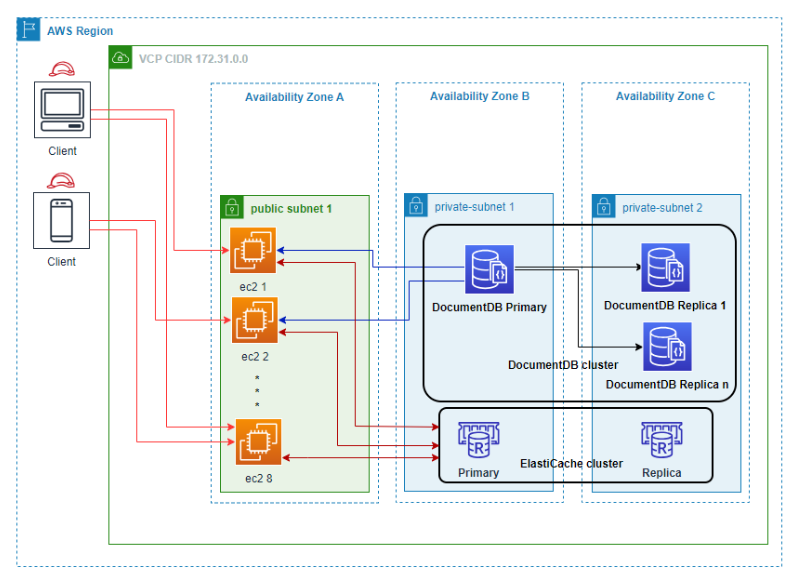
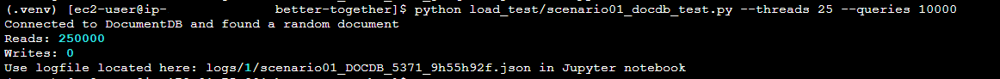
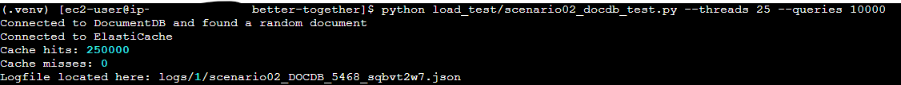
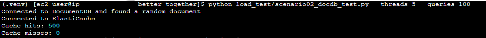

# Amazon ElastiCache Caching for Amazon DocumentDB (with MongoDB compatibility)
__Optimize cost, increase throughput and boost performance of Amazon RDS workloads using Amazon ElastiCache__

The purpose of this project is to help you reproduce test harness of DocumentDB [Amazon DocumentDB ](https://aws.amazon.com/documentdb/) with and without a Caching service such as [Amazon ElastiCache](https://aws.amazon.com/elasticache/).

In-memory caching improves application performance by storing frequently accessed data items in memory, so that subsequent reads can be served significantly faster than reading from the primary database that may default to disk-based storage.

### Sample dataset

For practical purposes the data used for this test was 10 million auto generated JSON documents where the _id filed was an increasing numeric value. 

You can bring your own databaset and run this harness as long at the document id filed numeric as we randomly generate numeric values.

### Architecture

The following Architecture diagram shows the test environment using [Amazon Elastic Compute Cloud](https://aws.amazon.com/pm/ec2/) (EC2) as the compute layer where 1 or more instances can be used to send requests to our databases DocumentDB + ElastiCache. For this particular test [Amazon ElastiCache for Redis](https://aws.amazon.com/elasticache/redis/) is used, but note that a similar test can be done using [Amazon ElastiCache for Memcached](https://aws.amazon.com/elasticache/memcached/). 



## Deploy Infrastructure

### Run tests on your existing infrastructure

__Prerequisites__

- [Python 3.8+](https://www.python.org/)
- DocumentDB service that you have access to
- ElastiCache instance that you have access to
- EC2 Instace, bastion host, with access to an ElastiCache and DocumentDB clusters and a public IP.
- For the bastion host to have easy access to DocumentDB and ElastiCache place all services in the same VPC Security Group and grant ingress on ports 27017 and 6379 from the same security group.
- For the security group your EC2 host belongs to update the inbound rules to allow cutom TCP on port 8888 from your computer IP only. i.e IP/32. 

1. Log into the Bastion Host EC2 instance

2. Clone this repository
```bash
git clone https://github.com/aws-samples/amazon-documentdb-samples/tree/master
cd blogs/better-together
```

## Run Performance Tests

1. Configure performance test

```bash
cd better-together
# Create a Python environment
python3 -m venv .venv
source .venv/bin/activate
# Check version
python -V
# Install required packages
pip install -r requirements.txt
cp .env.example .env
```

2. Configure `ElastiCache` and `DocumentDB` details by updating the `.env` file
```
export DOCDB_HOST=<your documentdb endpoint>
export DOCDB_DB="better_together"
export DOCDB_COL="test_data"
export DOCDB_USER="docdbadmin"
export DOCDB_PASS="<your password>"
export DOCDB_PORT=27017

export ELASTICACHE_ENDPOINT=<your elasticache endpoint>
export ELASTICACHE_PORT=6379
```

3. Run intial load test Without ElastiCache
```bash
python load_test/scenario01_docdb_test.py --threads 25 --queries 10000
```

The output in the console should look similar to the following screenshot:



For different loads adjust the number of threads and/or number of queries to be execute. 
The default are 4 threads and 10 execution. Use --log-tag to use specific log string else it default to a random string. You can increase the load by executing multiple scripts in parallel. Make sure to use the same log_tag for easy of analysis.

4. Run loat test With ElastiCache

```bash
python load_test/scenario02_docdb_test.py --threads 25 --queries 10000
```

The output in the console should look similar to the following screenshot:



5. Analyze performance metrics via the included Jutyter notebook

```bash
jupyter lab --ip 0.0.0.0
```
The output in the console should look similar to the following screenshot:


Capture the token and use it in your browser to have access to the Jupyter notebook.

In your browser enter the bastion host's public IP. Make sure your VPC security group was updated to allow inbound traffic on port 888 from you IP only. Remove the "s" from the URL as this notebook is not secure. Add port 8888 to the URL. For example: http://1.2.3.4:8888/
Enter the logfile name you captured during the execution in the notebook cell and run all cells.
For example:


Repeat the test but this time execute scenario02 to use ElastiCache in addition to DocumentDB. You will need to execute it more than once with a sufficiently high total thread and query number to warm up the cache. The test output will indicate the number of cache hits and misses. As the cache misses decrease the better the performance will get. 
For example:



Copy the logfile into the notebook as before and compare the performance results.
### Credits