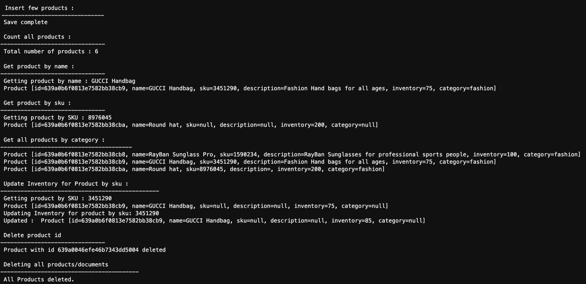

# Integrating Spring Boot application with Amazon DocumentDB

## Introduction

This is a sample Spring Boot application to demonstrate integration between Spring Boot and Amazon DocumentDB. For more information on how to use this solution, refer to the [BLOG](https://aws.amazon.com/blogs/database/category/database/amazon-document-db/).


## Requirements

* An AWS account
* Amazon DocumentDB cluster, If you don’t already have an Amazon DocumentDB cluster, see Getting Started with [Amazon DocumentDB (with MongoDB compatibility)](https://docs.aws.amazon.com/documentdb/latest/developerguide/get-started-guide.html) to create a new cluster.
* Integrated development environment (IDE) like [Eclipse](https://www.eclipse.org/downloads/) or [AWS Cloud9](https://aws.amazon.com/cloud9/). 
*  Java 1.8+, see [Install required tools](https://docs.aws.amazon.com/cloud9/latest/user-guide/sample-java.html#sample-java-install) section to install or upgrade java in AWS Cloud9 
*  Maven , see [Set up with Maven](https://docs.aws.amazon.com/cloud9/latest/user-guide/sample-java.html#sample-java-sdk-maven) section to install Maven in AWS Cloud9
*  [Spring Initializer](https://start.spring.io/)  


## Installation Instructions

1. On command prompt/terminal/Cloud9 environment, Create a new directory, navigate to the directory
2. Clone the GIT repository with the following command

```bash
 git clone https://github.com/aws-samples/amazon-documentdb-samples.git
```

## Update Configuration 

To connect to Amazon DocumentDB cluster, you specify the connection URI string in the application.properties file located in the src/main/resources folder.

1.  Add connection URI to the application.properties file.  Key for the connection URI is `spring.data.mongodb.uri`.  Make sure your copied connection string is in below format. Replace <user name>, <password> and <cluster end point> with your cluster specific details. 

```bash  
spring.data.mongodb.uri=mongodb://<user name>:<password>@<cluster end point>: 27017/?ssl=true&replicaSet=rs0&readPreference=secondaryPreferred&retryWrites=false
``` 
Alternatively, you can also provide the connection details separately like host name, port, user name and password with corresponding property keys. e.g : ‘spring.data.mongodb.host’ or ‘spring.data.mongodb.port’, see [Common Application Properties](https://docs.spring.io/spring-boot/docs/current/reference/html/application-properties.html#appendix.application-properties.data) for complete list of available Spring Boot parameter configuration options. 

2.  Optionally, you can also specify the database name in the `application.properties` file. 

```bash  
spring.data.mongodb.database=catalog
```

## Connecting with TLS Enabled
For connecting to a TLS-enabled Amazon DocumentDB cluster from a java based Spring boot application, your program must use the AWS-provided certificate authority (CA) file to validate the connection. To use the Amazon RDS CA certificate, do the following:
1.  Create a temporary certs folder under tmp folder.  You can create the folder for storing the certificates based on your organization security policies. For this post you are creating certs folder under tmp

```bash 
mkdir /tmp/certs/ 
```

2.  Create a trust store with the CA certificate contained in the file by performing the following commands. 

The following is a sample shell script that imports the certificate bundle into a trust store on a Linux operating system. For other options , see Connecting with TLS Enabled.

```bash 
mydir=/tmp/certs
truststore=${mydir}/rds-truststore.jks
storepassword=changeit

curl -sS "https://s3.amazonaws.com/rds-downloads/rds-combined-ca-bundle.pem" > ${mydir}/rds-combined-ca-bundle.pem
awk 'split_after == 1 {n++;split_after=0} /-----END CERTIFICATE-----/ {split_after=1}{print > "rds-ca-" n ".pem"}' < ${mydir}/rds-combined-ca-bundle.pem

for CERT in rds-ca-*; do
  alias=$(openssl x509 -noout -text -in $CERT | perl -ne 'next unless /Subject:/; s/.*(CN=|CN = )//; print')
  echo "Importing $alias"
  keytool -import -file ${CERT} -alias "${alias}" -storepass ${storepassword} -keystore ${truststore} -noprompt
  rm $CERT
done

rm ${mydir}/rds-combined-ca-bundle.pem

echo "Trust store content is: "

keytool -list -v -keystore "$truststore" -storepass ${storepassword} | grep Alias | cut -d " " -f3- | while read alias 
do
   expiry=`keytool -list -v -keystore "$truststore" -storepass ${storepassword} -alias "${alias}" | grep Valid | perl -ne 'if(/until: (.*?)\n/) { print "$1\n"; }'`
   echo " Certificate ${alias} expires in '$expiry'" 
done

```

## Run and Test

Run your Spring Boot application with following Maven command: 

```bash
mvn spring-boot:run
```

Following is the sample output of your Spring Boot Application. 




