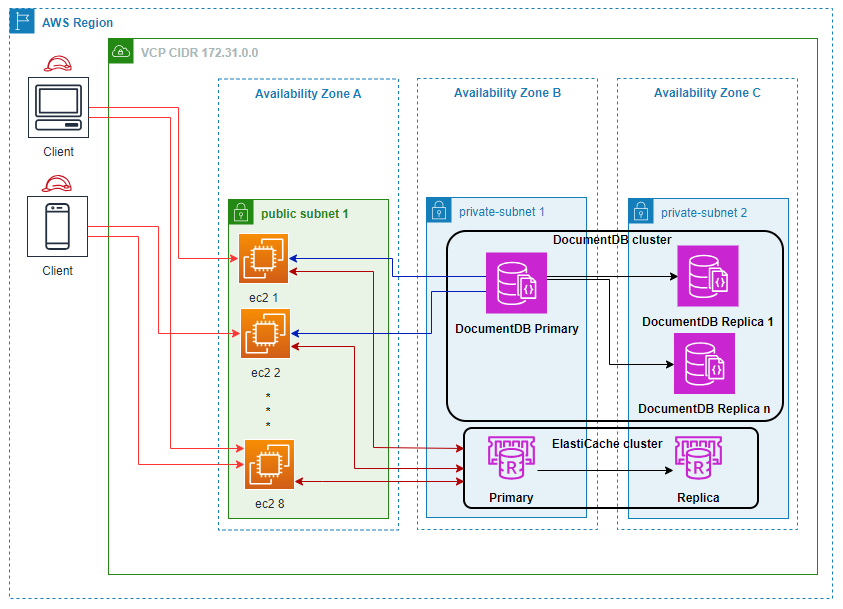
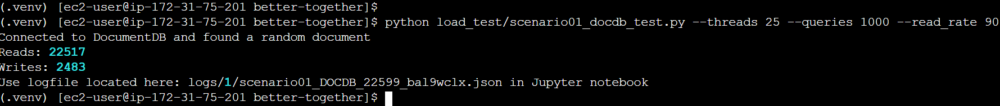
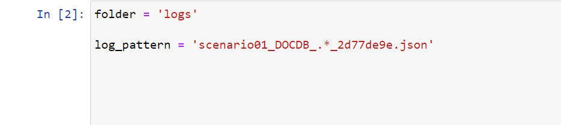
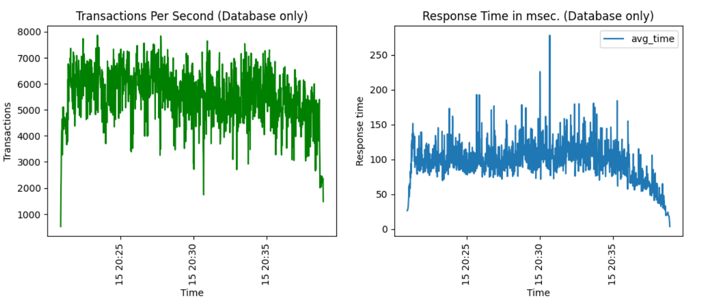
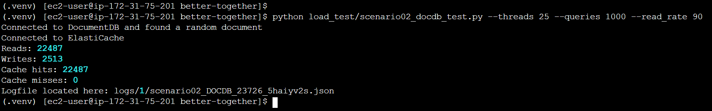
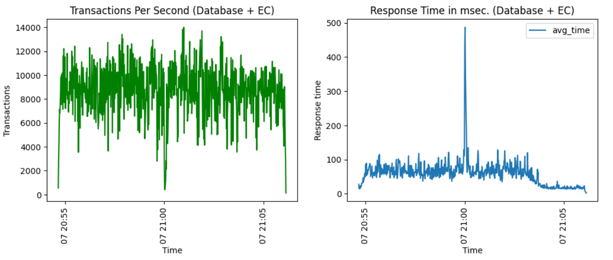

# Amazon ElastiCache Caching for Amazon DocumentDB (with MongoDB compatibility)
__Optimize cost, increase throughput and boost read performance of Amazon DocumentDB workloads using Amazon ElastiCache__

The document provides guidance on how to execute the test harness that runs against  [Amazon DocumentDB ](https://aws.amazon.com/documentdb/) running in conjunction with a data caching service such as [Amazon ElastiCache](https://aws.amazon.com/elasticache/) and then compare the average response time, throughput, and cost of this architecture to one that runs on Amazon DocumentDB only.

In-memory caching improves application performance by storing frequently accessed data items in memory, so that subsequent reads can be served significantly faster than reading from the primary database, that may default to disk-based storage. Also adding a cache to your database is much cheaper than scaling your primary database to meet increasing application demand.

### Sample dataset

For practical purposes the data used for this test was 10 million auto generated JSON documents where the id filed was an increasing integer value. You can use and existing dataset and run this performance harness as long at the document id filed is numeric as the test randomly generate integer values used for document IDs.

### Architecture

The following Architecture diagram shows the test environment using [Amazon Elastic Compute Cloud](https://aws.amazon.com/pm/ec2/) (EC2) as the compute layer where one or more instances can be used to send requests to your databases DocumentDB + ElastiCache. For this particular test [Amazon ElastiCache for Redis](https://aws.amazon.com/elasticache/redis/) is used, but note that a similar test can be done using [Amazon ElastiCache for Memcached](https://aws.amazon.com/elasticache/memcached/). Both the instance based and the more recently released serverless version of ElastiCache can be used.



## Deploy Infrastructure

### Run tests on your existing infrastructure

__Prerequisites__

- [Java](https://www.java.com/en/)
- [Python 3.8+](https://www.python.org/)
- Amazon DocumentDB cluster with at least one t3.medium instance. You can use an existing Amazon DocumentDB cluster or [create a new one](https://docs.aws.amazon.com/documentdb/latest/developerguide/db-cluster-create.html). This post assumes the default values for port (27017) and no TLS settings.
- AWS ElastiCache provisioned or serverless service that you have access to. The ElastiCache cluster has to be in the same VPC as your EC2 instances are. Default user was used without a set password. [create a new one](https://docs.aws.amazon.com/AmazonElastiCache/latest/red-ug/Clusters.Create.html). Again without TLS enabled. 
- EC2 instance based on a Linux OS image with access to both ElastiCache and DocumentDB services and a public IP. An EC2 instance type with 4 or more CPUs is recommended. [create a new one](https://docs.aws.amazon.com/efs/latest/ug/gs-step-one-create-ec2-resources.html)
- EC2 instance to allow inbound traffic on port 8888 (used by JupyterLab) from your computer's IP addressonly. [See documentation here](https://docs.aws.amazon.com/vpc/latest/userguide/security-group-rules.html). 

#### Prepare environment and load DocumentDB mock data 
1. Connect to you EC2 instance via SSH or Session Manager.
2. Use nosqlbench tool load mock data into DocumnetDB.
Refer to the sample in [Steps to run NoSQLBench against Amazon DocumentDB](https://github.com/aws-samples/amazon-documentdb-samples/tree/master/samples/nosqlbench) to load data.

3. Save the file [better_together.yaml](load_data/better_together.yaml) locally.
4. From same folder, run the following command to execute using *nosqlbench* tool.

```
java -jar nb5.jar run driver=mongodb yaml=better_together.yaml connection="<<documentdb_uri>>" tags=block:"write.*" database=better_together cycles=10M threads=auto errors=timer,warn -v --progress console:30s 
```

5. Clone this repository to copy the test harness code.
```bash
git clone https://github.com/aws-samples/amazon-documentdb-samples/tree/master
cd amazon-documentdb-samples\blogs\elasticache_docdb_better_together
```

5. Prepare EC2 instance

```bash
# Create a virtual Python environment. Your version of python 3 might be different make sure you are using version 3.8 or higher.
python3 -m venv .venv
source .venv/bin/activate
# Check version
python -V
# Install required packages
pip install -r requirements.txt
# Copy the included environment file
cp .env.example .env
```

6. Configure `ElastiCache` and `DocumentDB` details to reflect your environment by updating the `.env` file. You can view your database and cache endpoints via the AWS Console.

```
export DOCDB_HOST=<your documentdb endpoint>
export DOCDB_DB="better_together"
export DOCDB_COL="test_data"
export DOCDB_USER="docdbadmin"
export DOCDB_PASS="<your password>"
export DOCDB_PORT=27017

export ELASTICACHE_ENDPOINT=<your elasticache endpoint>
export ELASTICACHE_PORT=6379
```

7. Source the updated .env file so that the variables will be exported.

```bash
source .env
```

#### Run DocumentDB only performance test

1. Run initial performance test utilizing the DocumentDB only (without ElastiCache) This will provide a baseline performance of your DocumentDB.

```bash
python load_test/scenario01_docdb_test.py --threads 25 --queries 10000 --read_rate 90
```

The output in the console should look similar to the following screenshot:



To simulate different loads adjust the number of threads and/or number of queries to be execute. The number of threads increases the overall load and the number of queries extend the time the test will run. Smaller loads often are not sufficient to see the difference of the proposed architecture.
The defaults are 4 threads and 10 executions per thread with a read rate of 90 (~90% read and ~10% write). Use --log_tag option to tag execution log files with a specific string else each log will have a random tag. 
On a client computer with multiple CPU cores, to simulate multiple users, it is better to execute multiple processes in parallel than to increase the number of threads within a single process, especially passed 64 treads are used per process. Use the same log_tag parameter for multiple executions to combine the resuls and easy analysis.

For example:
To simulate 100 users first generate a random log_tag. Then use two processes with 50 threads each and the same log_tag value instead of a single process with 100 threads. This will distribute the load to two local CPUs.

```
log_ext=$(echo $RANDOM | md5sum | head -c 8)
python load_test/scenario01_docdb_test.py --threads 50 --queries 10000 --read_rate 90 --log_tag $log_ext &
python load_test/scenario01_docdb_test.py --threads 50 --queries 10000 --read_rate 90 --log_tag $log_ext &
```

2. To analyze performance metrics start JupyterLab in the same virtual Python environment. Execute the include driver script setup_jupyter.bash that will start JupyterLab as a background process.

    ```bash
    ./setup_jupter.bash
    ```

For convenience reasons (this configuration is not intended for production) the JupyterLab password has been set to "test123".

3. In your web browser enter the EC2 host's public IP. Remove the "s" from the EC2's URL as the lab is not secure, and change the port to 8888. For example: http://1.2.3.4:8888/lab if your EC2's IP address is 1.2.3.4.
4. At the prompt enter the preset password (test123). Then open the plot_results_db_only.ipynb file.
5. In the second cell enter/update the value for the log_pattern variable. The value is the logfile name you captured during the scenario execution. The log file has the following format: scenario01_DOCDB_<process#>_<log_tag>.json. If more than one process was executed that generated multiple log files. Enter a wildcard (.*) for the process number. Logfiles are located under logs/1 subdirectory. 

For example:



The last cell will display performance charts plotting the average number of request per second and the average response time in two separate charts.



#### Run DocumentDB and ElasitCache performance test

1. To run a performance test utilizing both DocumentDB and ElastiCache. Repeat the above test but this time execute the scenario02_docdb_test.py script. The parameters to this script are similar to the scenario01 script.

```bash
python load_test/scenario02_docdb_test.py --threads 25 --queries 10000 --read_rate 90
```

The output in the console should look similar to the following screenshot:



You may need to execute it more than once or with a sufficiently large workload (number of threads and number of query executions) to warm up the cache. Each execution output will indicate the number of cache hits and misses. As the cache misses decrease the better the performance will get.

In the JupyterLab open the plot_results_db_and_cache.ipynb file and update the log_pattern value as before. Then run all cells to analyze the results. You should see an increase in the number of averate requests per second and a decrease in the averate response time. Again, the last cell will display the charts. All values represent measured observed by the test harnes on the CE2 instance.



## Conclusion

For read intensive workloads using a Amazon ElastiCache caching layer with Amazon DocumentDB can optimize cost, increase throughput and boost overall performance. However, each workload is unique, repetitive read requets benefit greatly from using a caching service. Please analyze your workloads thoroughly before making a decision for your production architecture.

## Authors

Please reach out to us in case you have questions

- [Steven Hancz](https://www.linkedin.com/in/steven-hancz/)
- [Sourav Biswas](https://www.linkedin.com/in/biswassourav/)
