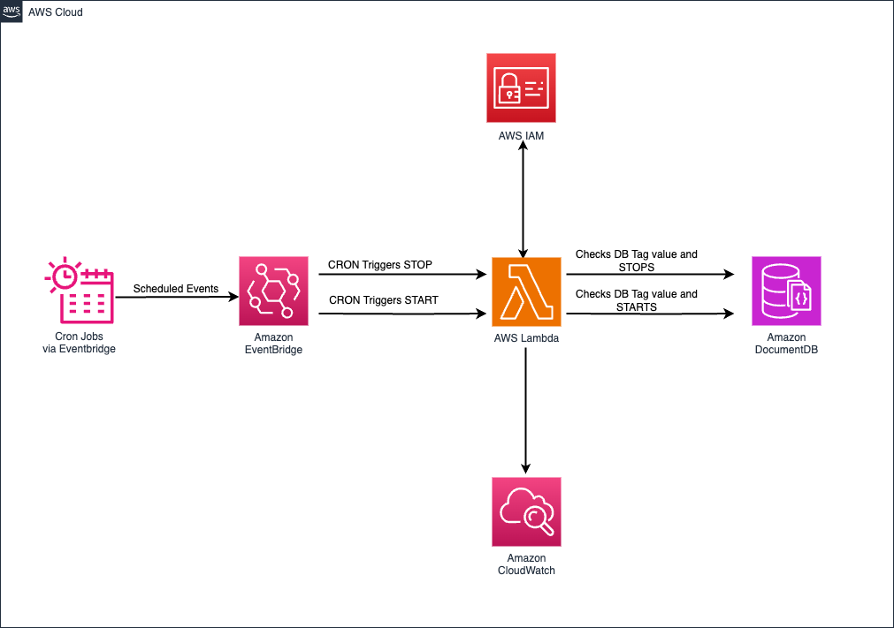
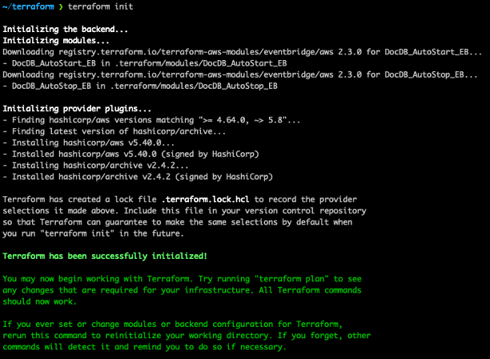
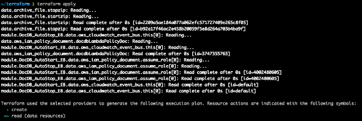
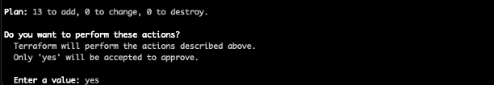
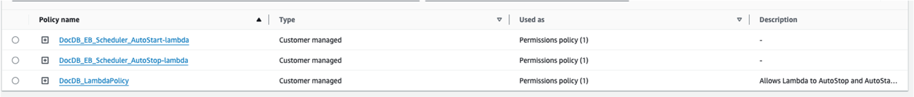
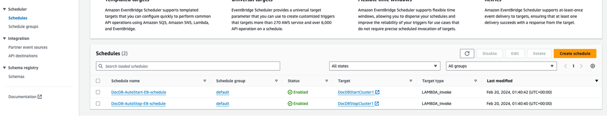
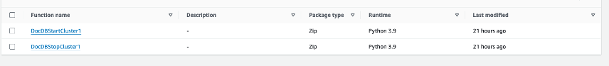

# Saving costs on Amazon DocumentDB using event-driven architecture and the AWS EventBridge Terraform module

## Overview
This is a sample deployment of AWS Lambda and Amazon EventBridge using the [AWS EventBridge Terraform Module](https://registry.terraform.io/modules/terraform-aws-modules/eventbridge/aws/latest) to automatically start and stop Amazon DocumentDB clusters based on tag values. See the AWS blog [Automate Cost Optimization on Amazon DocumentDB with AWS Lambda, Amazon EventBridge, and the AWS EventBridge Terraform Module](https://aws.amazon.com/) for more information.

Once deployed, EventBridge Scheduler will run the AutoStart and AutoStop schedules based on the following cron expressions.

AutoStop
```
30 17 ? * MON-FRI *
``` 

AutoStart
```
0 8 ? * MON-FRI *
```

This starts the targetted Lambda functions that stop your appropriately tagged Amazon DocumentDB clusters every weekday (Monday - Friday) at 5:30PM UTC-05:00 and start them again every weekday (Monday - Friday) at 8:00 AM UTC-05:00.

To adjust these for your needs, you can modify the `DocDB_AutoStop_EB` and `DocDB_AutoStart_EB` modules in `main.tf`. For example, the schedule for `DocDB_AutoStop_EB` is:

```
      schedule_expression = "cron(30 17 ? * MON-FRI *)"
      timezone            = "America/Chicago"
```

If you wanted to change this to stop your clusters every day at 12:15PM UTC+01:00, you would use the following:

```
      schedule_expression = "cron(15 12 * * ? *)"
      timezone            = "Europe/Amsterdam"
```

You can reference the [Amazon EventBridge User Guide](https://docs.aws.amazon.com/eventbridge/latest/userguide/eb-cron-expressions.html) for cron expressions. For `timezone`, EventBridge Scheduler uses the [Time Zone Database](https://www.iana.org/time-zones) maintained by the Internet Assigned Numbers Authority (IANA).

## Architecture diagram



## Requirements

+ [Terraform $\ge$ v1.7.4](https://developer.hashicorp.com/terraform/tutorials/aws-get-started/install-cli)
+ [AWS CLI version 2](https://docs.aws.amazon.com/cli/latest/userguide/cli-chap-welcome.html)
+ [Terraform AWS Provider $\ge$ 5.8](https://registry.terraform.io/providers/hashicorp/aws/latest/docs)
+ [AWS EventBridge Terraform module $\ge$ 3.2.3](https://registry.terraform.io/modules/terraform-aws-modules/eventbridge/aws/latest)

You will need to add tags to your Amazon DocumentDB clusters that you want to automatically start and stop. You can learn about adding tags in the [Amazon DocumentDB Developer Guide](https://docs.aws.amazon.com/documentdb/latest/developerguide/tagging.html).

| **Key**  | **Value** |
| ------- | ----------- |
AutoStop  | true |
AutoStart | true |


## Deployment

Clone the repository and install the requirements per the links above for your operating system.

Make a `terraform.tfvars` file using the `terraform.tfvars.template` and provide values for your `aws_region` and `aws_account_id`. This is used to create the IAM policy document that is assigned to the Lambda functions.

```
    resources = [
      "arn:aws:rds:${var.aws_region}:${var.aws_account_id}:cluster:*",
      "arn:aws:logs:${var.aws_region}:${var.aws_account_id}:*"
    ]
```

From your terminal, `initialize` the Terraform workspace and `apply` it's execution plan.

```
terraform init
terraform apply
```

After running `init`, you should receive confirmation that it has been successfully initialized.



After running `apply` you will be prompted to confirm applying the execution plan. Enter `yes`.





You will then receive an `Apply complete!` message confirming the deployment.


## Confirmation

You can confirm the successful deployment within the [IAM policy menu within AWS console](https://us-east-1.console.aws.amazon.com/iam/home#/policies) and filtering for Policies starting with `DocDB`.



Next, access the [EventBridge Scheduler menu](https://us-east-1.console.aws.amazon.com/scheduler/home#schedules) to confirm deployment of the `DocDB-AutoStart-EB-schedule` and `DocDB-AutoStop-EB-schedule` schedules.  



From here you can either select the `Target` for each `Schedule name` to access the Lambda functions, or access the [Lambda Functions menu in console](https://us-east-1.console.aws.amazon.com/lambda/home#/functions). You will see functions `DocDBStartCluster1` and `DocDBStopCluster1`.



Note: As per best practices, please follow below guidance on deploying the lambda function to your accounts :

1.    Restrict Lambda Function Permissions: Ensure that the Lambda function's execution role has the minimum set of permissions required to perform its intended tasks and nothing more. Documentation can be found here - https://docs.aws.amazon.com/lambda/latest/dg/lambda-permissions.html.
2.    Implement AWS CloudTrail Logging: Enable AWS CloudTrail logging for your Lambda functions. This will provide you with detailed logs of all the actions performed by the Lambda function, including any attempts to start/stop clusters. With CloudTrail logs, you can monitor for any suspicious activity and take appropriate action if needed. Documentation can be found here - https://aws.amazon.com/blogs/mt/gain-visibility-into-the-execution-of-your-aws-lambda-functions-with-aws-cloudtrail/.
3.    Use AWS Lambda Aliases and Versions: Instead of directly updating the Lambda function's code, you can leverage AWS Lambda Aliases and Versions. This allows you to create a new version of the Lambda function, test it, and then promote it to production by updating the alias. This way, you can ensure that any code changes go through a proper testing and approval process before being deployed to production. Documentation can be found here - https://docs.aws.amazon.com/lambda/latest/dg/configuration-aliases.html.
4.    Implement AWS Lambda Code Signing (Optional): If you decide to implement code signing for your Lambda functions. Documentation can be found here - https://docs.aws.amazon.com/lambda/latest/dg/code-signing.html.

## Cleanup

To remove the resources created in the sample, run the following command from your terminal in the `terraform` directory of the cloned repository.

```
terraform destroy
```