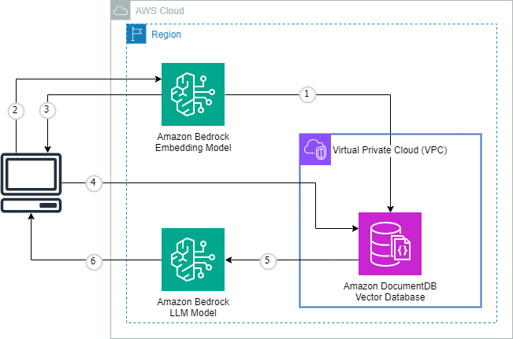

# Use LangChain and vector search on Amazon DocumentDB to build a generative AI chatbot

## Introduction

This is an example of how to create a chatbot that can query your large language model (LLM) by using LangChain after loading your embeddings into Amazon DocumentDB. Visit the [AWS blog](https://aws.amazon.com/blogs/database/) to view more information.

## Requirements
- An AWS account
- Permissions to create/modify AWS resources (Amazon DocumentDB, Amazon SageMaker, Amazon Bedrock, Amazon Secrets Manager)
- [Model access](https://docs.aws.amazon.com/bedrock/latest/userguide/model-access.html) to Claude 3 Sonnet
- AWS [LangChain provider](https://python.langchain.com/docs/integrations/vectorstores/documentdb) for Amazon DocumentDB
- [LangChain chat model for Bedrock API](https://api.python.langchain.com/en/latest/chat_models/langchain_community.chat_models.bedrock.BedrockChat.html)
- An [Amazon DocumentDB cluster](https://docs.aws.amazon.com/documentdb/latest/developerguide/db-cluster-create.html) running engine version 5 with [credentials stored in AWS Secrets Manager](https://aws.amazon.com/blogs/security/how-to-rotate-amazon-documentdb-and-amazon-redshift-credentials-in-aws-secrets-manager/). 
- Jupyter notebook deployed to the same VPC as your Amazon DocumentDB cluster. You can follow this instructions covered in [this AWS Database Blog](https://aws.amazon.com/blogs/database/getting-started-with-amazon-documentdb-with-mongodb-compatibility-part-4-using-amazon-sagemaker-notebooks/), use [this sample](https://github.com/aws-samples/documentdb-sagemaker-example) from the asws-samples repository, or follow the instructions in the [Developer Guide](https://docs.aws.amazon.com/sagemaker/latest/dg/infrastructure-connect-to-resources.html). 
- Your Notebook instance will need [LangChain](https://pypi.org/project/langchain/) and [PyMongo](https://pypi.org/project/pymongo/) installed. 
- If you cluster is configured using default security settings for data in transit, the notebook will need local access to the [global-bundle.pem](https://docs.aws.amazon.com/documentdb/latest/developerguide/connect_programmatically.html#connect_programmatically-tls_enabled) in order to make a secure connection to your cluster. 
- This example utilizes a copy of the [Amazon DocumentDB Developer Guide](https://docs.aws.amazon.com/pdfs/documentdb/latest/developerguide/developerguide.pdf); your notebook will need local access to this as well.

## Solution Architecture



1. Using the embeddings model you've selected, Amazon Bedrock generates embeddings for the source data stored in Amazon DocumentDB
2. User sends question - the question is forwarded to the same embeddings model for conversion into vector embeddings
3. Embeddings model responds with embeddings
4. Embeddings sent to DocumentDB for searching similar documents with vector search
5. Search results sent to Large Language Model in Amazon Bedrock for meaningful response construction
6. Results displayed to User

## Inputs

#### *Cell 2*
Provide the `secret_name` and `region_name` for your Amazon DocumentDB cluster's secret.

#### *Cell 3*
If running on an Amazon SageMaker Notebook instance and you have uploaded the `global-bundle.pem` file to it's local storage, you can modify the `tls_file_location` similar to below:

```
    tls_file_location = '/home/ec2-user/SageMaker/global-bundle.pem' 
```
#### *Cell 5*
Modify the `create_index` command to specify the [similarity](https://docs.aws.amazon.com/documentdb/latest/developerguide/vector-search.html#w5aac21c11c11) you would like to use. For example:

```
    collection.create_index([("vectorContent","vector")], 
        vectorOptions= {
            "type": "hnsw", 
            "similarity": "euclidean",
            "dimensions": 1536,
            "m": 16,
            "efConstruction": 64},
        name="hnsw")
```
#### *Cell 7*
If running on an Amazon SageMaker Notebook instance and you have uploaded the `developerguide.pdf` file to it's local storage, you can modify `files` location to:

```
    files = '/home/ec2-user/SageMaker/' 
```

#### *Cell 13*
To modify the question you would like to ask, change the values of `<query>`. 

```
    output = qa.invoke({"query": "What is the total amount of data I can store in DocumentDB?"})
```

#### *Cell 14*
To modify the question you would like to ask, change the values of `<query>`.

```
    query = "What is the total amount of data I can store in DocumentDB?"
```

#### *Cell 15*
To modify the question you would like to ask, change the values of `<query>`.

```
    embedded_query = embeddings.embed_query("What is the total amount of data I can store in DocumentDB?")
```

Modify the value of `<similarity>` to match the similarity value you used in *Cell 5* to create your vector index. For example:

```
    search = collection.aggregate([{'$search': {"vectorSearch" : {"vector" : embedded_query, "path": "vectorContent", "similarity": "euclidean", "k": 5}}}])
```