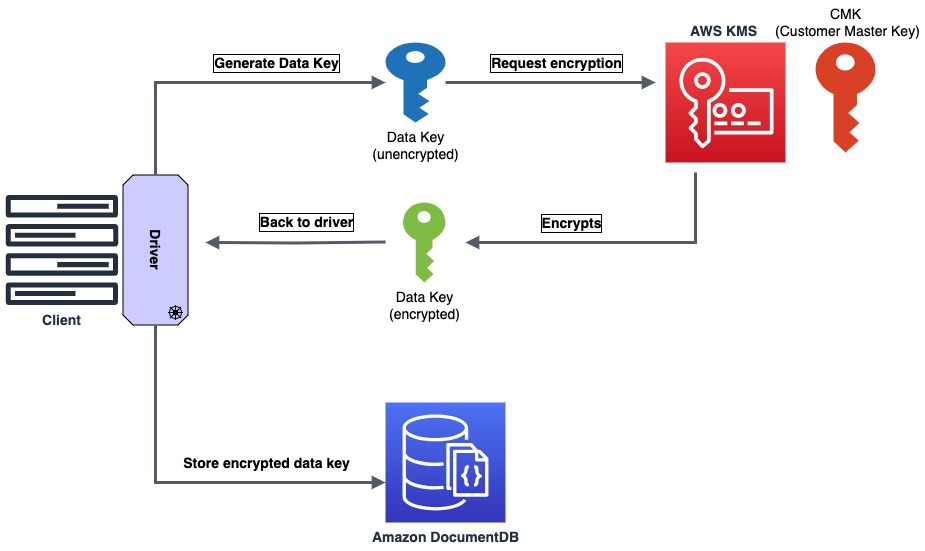
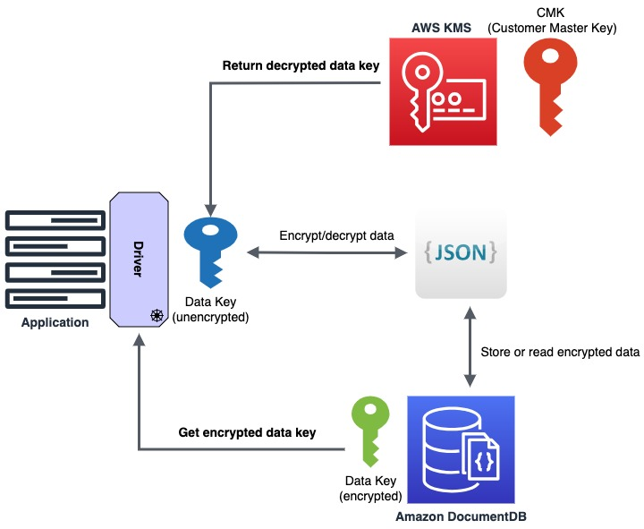

# Amazon DocumentDB - Client side field level encryption demo 

Sample Python code to:
 - Generate data encryption keys and encrypt them with a master key
 - CRUD operations to encrypt and decrypt data stored in Amazon DocumentDB

Reference: [Introducing Client-Side Field Level Encryption and MongoDB 5.0 API compatibility in Amazon DocumentDB](https://aws.amazon.com/blogs/database/introducing-client-side-field-level-encryption-and-mongodb-5-0-api-compatibility-in-amazon-documentdb/)

## Requirements

- Python 3.x with modules:
  - Pymongo with encryption
  - Boto3
```
pip3 install pymongo pymongo[encryption] pymongo[aws] boto3
```
- TLS CA file 'global-bundle.pem' in the same path of the scripts.
```
wget https://truststore.pki.rds.amazonaws.com/global/global-bundle.pem
```
- Update the **config.json** file and specify the values for the required variables:
  - "SECRET_NAME": "Name of the secret in AWS Secrets Manager containing credentials for Amazon DocumentDB"
  - "AWS_REGION": "AWS Region where your resources are located, e.g. eu-west-1"
  - "KMS_KEY_ARN": "The ARN of the Master key stored in AWS KMS, this will be used to encrypt the data keys"

#### AWS Resources:
- An Amazon DocumentDB cluster, see [Creating an Amazon DocumentDB Cluster](https://docs.aws.amazon.com/documentdb/latest/developerguide/db-cluster-create.html)
- A secret stored in AWS Secrets Manager, containing the credentials for the Amazon DocumentDB cluster, see [Create an AWS Secrets Manager database secret](https://docs.aws.amazon.com/secretsmanager/latest/userguide/create_database_secret.html)
- A customer managed key (CMK) stored in AWS KMS, follow the steps in the [blog](https://aws.amazon.com/blogs/database/introducing-client-side-field-level-encryption-and-mongodb-5-0-api-compatibility-in-amazon-documentdb/) to create one.
- An Amazon EC2 instance or a AWS Cloud9 environment in the same VPC as the Amazon DocumentDB cluster
- An AWS IAM Role attached to the EC2 instance (or Cloud9 environment). This role should also be added as a Key User for the CMK key created in AWS KMS. The role will have a policy with the following permissions:

```
{
    "Version": "2012-10-17",
    "Statement": [
        {
            "Sid": "EncryptDecrypt",
            "Effect": "Allow",
            "Action": [
                "kms:Encrypt",
                "kms:Decrypt",
                "kms:ReEncrypt*",
                "kms:GenerateDataKey*",
                "kms:DescribeKey"
            ],
            "Resource": "<ARN of Customer Master Key>"
        },
        {
            "Sid": "ReadSecret",
            "Effect": "Allow",
            "Action": [
                "secretsmanager:ListSecrets",
                "secretsmanager:GetSecretValue"
            ],
            "Resource": "<ARN of the secret for Amazon DocumentDB cluster>"
        }
    ]
}
```
 
## Usage csfle-genDataKey.py
This script will generate data encryption keys (DEK), encrypt them using the customer master key (CMK) and store it in Amazon DocumentDB.


 
```
python3 csfle-genDataKey.py --help
usage: csfle-genDataKey.py [-h] --key-vault KEY_VAULT [--key-alt-name KEY_ALT_NAME] {create,list}

Generate and manage data keys for Amazon DocumentDB clilent side field level encryption

positional arguments:
  {create,list}         [Required] Action to perform: create new data key or list existing keys

options:
  -h, --help            show this help message and exit
  --key-vault KEY_VAULT
                        [Required] The namespace where the data keys are stored, in the format '<database>.<collection>'
  --key-alt-name KEY_ALT_NAME
                        [Required for the 'create' action] The data Key Alt Name
```

#### Example:
Generate a DEK named `datakey-creditcard` and store it in the key vault namespace `encryption.keys` (database `encryption`, collection `keys`):
```
python3 csfle-genDataKey.py create --key-vault "encryption.keys" --key-alt-name datakey-creditcard
```
List the data keys from the key vault:
```
python3 csfle-genDataKey.py list --key-vault "encryption.keys"
```


## Usage csfle-demoapp.py
This script will perform read/write operations using encrypted data.
The document schema defined is:

```
{
  "_id": ObjectId(),
  "name": <string>,
  "email": <string>,
  "creditCard": encrypted_credit_card
}
```



```
python3 csfle-demoapp.py --help
usage: csfle-demoapp.py [-h] --key-vault-namespace KEY_VAULT_NAMESPACE --key-alt-name KEY_ALT_NAME [--document-id DOCUMENT_ID] {insert,update,read}

Insert, update, or read DocumentDB documents with field-level encryption

positional arguments:
  {insert,update,read}  The action to perform: insert, update, or read

options:
  -h, --help            show this help message and exit
  --key-vault-namespace KEY_VAULT_NAMESPACE
                        The key vault namespace
  --key-alt-name KEY_ALT_NAME
                        The key alt name
  --document-id DOCUMENT_ID
                        The _id of the document (for update and read actions)
```

### Example:

Insert a document and encrypt the field `creditCard` using the DEK named `datakey-creditcard` stored in the key vault `encryption.keys`: 
```
python3 csfle-demoapp.py insert --key-vault-namespace "encryption.keys" --key-alt-name datakey-creditcard

Inserted document with name: Customer2
_id: 65199e9f980db04e5fff91a9
```

Read the encrypted document with _id 65199e9f980db04e5fff91a9:

```
python csfle-demoapp.py read --key-vault-namespace "encryption.keys" --key-alt-name datakey-creditcard --document-id 65199e9f980db04e5fff91a9

Read document with _id: 65199e9f980db04e5fff91a9
{'_id': ObjectId('65199e9f980db04e5fff91a9'),
 'creditCard': '1234-5678-9012-3456',
 'email': 'customer2@domain.tld',
 'name': 'Customer2'}
```

Update an existing document, where the creditCard field is not encrypted, using the DEK `datakey-creditcard`:

```
python csfle-demoapp.py update --key-vault-namespace "encryption.keys" --key-alt-name datakey-creditcard --document-id 6519a00e207b2695162eb2eb
```
