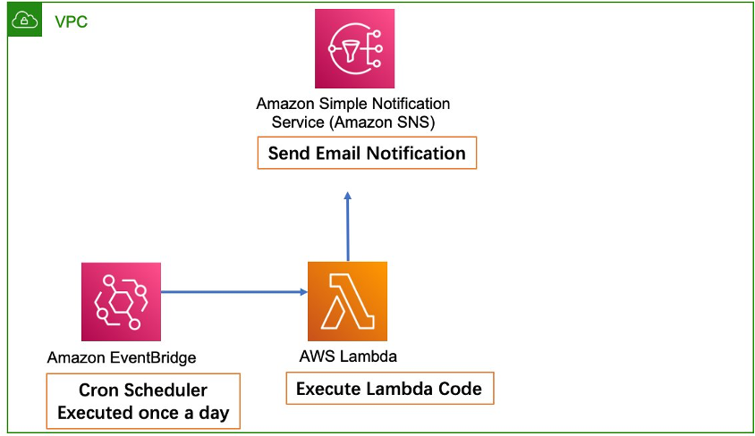
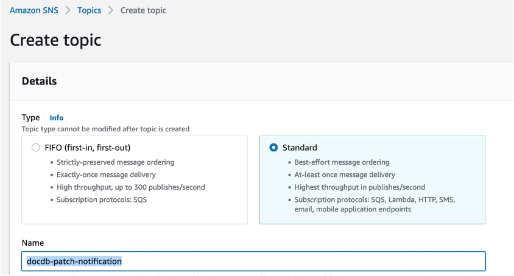
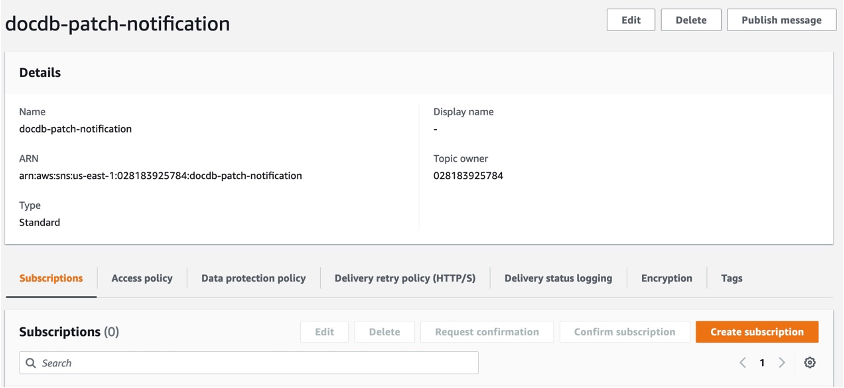

# DocumentDB Patch Auto Notification
**Automatically query available DocumentDB Patch**
## Architecture Diagram：

## Create an IAM Policy for Lambda
**Policy name: query-pending-maintenance**

**Policy  Json definition：**

**Please refer to Policy Json defefinition from the file deploy/policy.json**
## Create Role for Lambda
**Role Name: lambda-query-maintenance**

**Policy: query-pending-maintenance**
## Configure SNS service
1. **Create sns topic**

**docdb-patch-notification**

2. **Create topic subscription**

3. **Confirm subscription in the email：**

## Create Lambda
**Lambda Configuration：**

**Lambda name:** 
**query_docdb_maintenance**

**Lambda role:** 
**lambda-query-maintenance**

**Lambda Timeout:  7 Minutes（Change default timeout:  from 3 seconds to 7 minutes）：**

**Lambda Runtime: Python 3.7**

**Lambda Code:**

**Please refer to Lambda Python Code from the file deploy/lamda.py**

**Change the python code：TargetArn = "arn:aws:sns:us-east-1:02818***:docdb-patch-notification" 
**change Account id to your Account id)**

## Create event bridge
1. **Create event rule:**

**Rule_name: docdb-patch-notification_rule**

**Rule type: schedule**

2.	**Create event schedule:**

**Schedule_name: docdb-patch-notification-schedule (executed once a day)**

**Schedule Targe: Select the created Lambda function (invoke)**

**Create successfully：**

**Once create successfully, the lambda function would be executed, then executed once a day**

## Email Notification Example：

