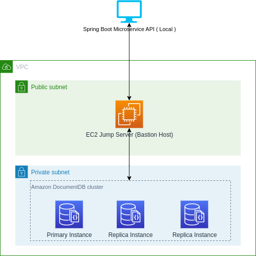

# Java and Spring Boot Starter project for Amazon DocumentDB

## Introduction
Setting up development environment for a new database may require going through countless tutorials and documentation pages. This is an example using Java and Spring Boot project that sets up development environment locally to work with Amazon DocumentDB. Project creates all required infrastructure, networking and resources to get started on your first Microservice project using Java and Spring Boot. Example uses ssh tunnel to work locally with Amazon DocumentDB. Follow the steps below to finish the installation. 


## Feature List at High Level
1. Orchestration through cloudformation template for VPC, Gateways, Amazon DocumentDB and EC2 jump server (Bastion Host). 
2. Java and Spring Boot Microservice project for basic CRUD operations. 
3. EC2 Jump server (Bastion Host) to connect to database as Amazon DocumentDB is a VPC only service. 



## Requirements 
1. JDK 17.0+ and Maven
2. [AWS CLI](https://docs.aws.amazon.com/cli/latest/userguide/cli-chap-configure.html) 2.4+  You must have run `aws configure` to set up your terminal for the AWS account and region of your choice.
3. Make command line tools.  [MacOs](https://formulae.brew.sh/formula/make), [Windows](https://linuxhint.com/install-use-make-windows/) 
4. Amazon DocumentDB [Mongo shell commands](https://docs.aws.amazon.com/documentdb/latest/developerguide/get-started-guide.html#cloud9-mongoshell). 


## Getting Started
Follow the following steps to setup environment locally


### Step 1 : Clone DotNet Starter project locally
Clone this project using following command: 

```
git clone https://github.com/aws-samples/amazon-documentdb-samples.git
cd amazon-documentdb-samples/samples/docdb-springboot-starter
```

### Step 2 : Create EC2 Key pair 
Use the following commands to create key pair and save that to the project. If you decide to change the key name then note it down. We will need to make changes to commands accordingly. 
```
mkdir keys
aws ec2 create-key-pair --key-name ec2-keypair --query 'KeyMaterial' --output text > keys/ec2-keypair.pem
chmod 400 keys/ec2-keypair.pem
```

### Step 3 : Deploy cloudformation template to setup infrastructure

```
make infra
```
Above will take about 15 mins to setup all the resources and permissions. You can check the progress of the CloudFormation [here](https://console.aws.amazon.com/cloudformation/home) and once complete you will see `'CREATE_COMPLETE'` message on CloudFormation Dashboard. 

### Step 4 : Start SSH Tunnel 
```
make tunnel
```
### Step 5 : Build your Microservice project 
This command may be needed to run in a separate terminal/command prompt. 
```
mvn clean package -DskipTests
mvn spring-boot:run 
```

### Step 6 : Verify Spring Boot Microservice Apis 
Commands at Step 4 shows the address and port where Web Apis are running. Open your favorite browser and start the following page. 
```
https://localhost:8080/api/locations
```
This should return empty results right now as there is no data loaded to DocumentDB Yet. Lets take care of that in following steps. 

### Step 7 : Load data to Amazon DocumentDB
This uses Restaurants.json file that comes with this project in the `data` directory. Use the following command to load to Amazon DocumentDB. 
```
mongoimport --username docdb --password docdb123 --file=data/restaurant.json --db=restaurants --collection=locations --writeConcern {w:0}
```

### Step 8 : Verify Data
Go back to your browser and refresh, you should now see list of restaurant locations coming back as a result set. 
```
https://localhost:8080/api/locations
```

### Verify Data in Amazon DocumentDB(Optional)
You can also connect to Amazon DocumentDB directly to verify data using mongo shell. Use following commands to verify:
```
mongosh --username docdb --password docdb123
use restaurants
db.locations.find().pretty()
```