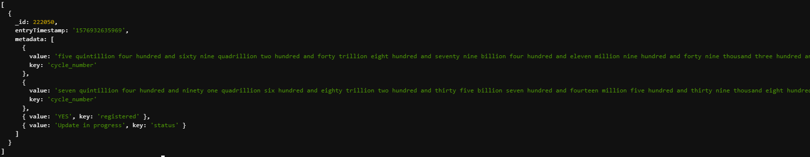
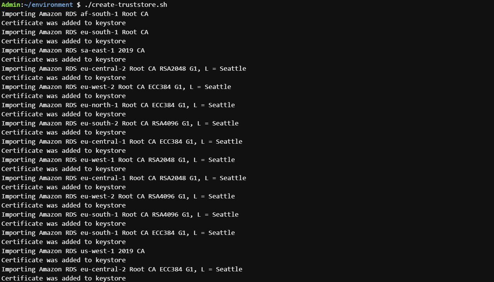
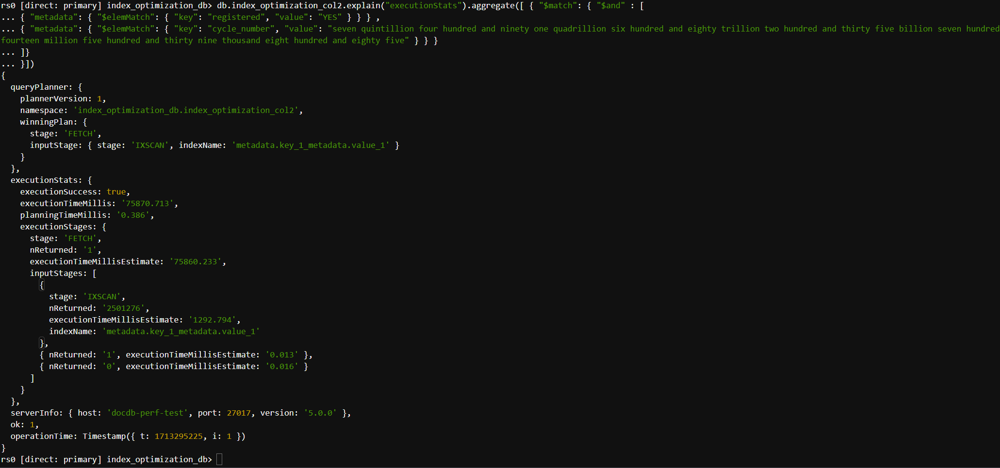
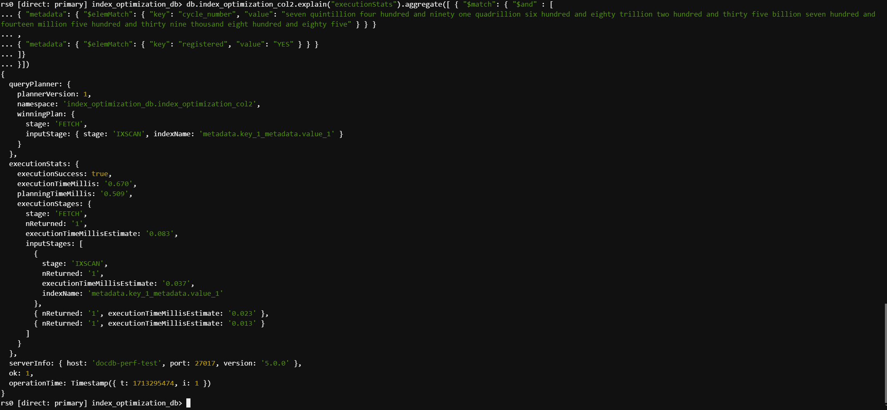

# Introduction and Use Case

In  [Amazon DocumentDB](https://aws.amazon.com/documentdb/)< for fields that have an array value, a multi-key index allows you to create an index key for each element in the array. The array can be scalar (strings or numbers) and nested documents. When using multiple $elemMatch along with $and /$or operators on indexed arrays containing nested objects as elements , Amazon DocumentDB query optimizer  can utilize indexes more efficiently when we arrange the query such that filters with low selectivity are at the very beginning of the query. This enables the narrowing down of the search scope of the first pass of the query execution to a fewer number of documents, leading to faster execution times.  

You can elevate performance for workloads that query arrays by tailoring queries to the cardinality of your data. This project aims to facilitate the replication of test setups for Amazon DocumentDB, demonstrating performance enhancements through optimal rewriting of array queries. With insights into your dataset, crafting array queries tailored to DocumentDB's cloud native engin can significantly optimize execution.

### Sample dataset

The data used for this test was 3.3 million auto generated JSON documents where the _id filed was an increasing numeric value with an array called metdata.
The array field metadata contains multiple documents of the following structure
                  {
           "key" : "<<string>>"
        "value" : "<<string>>"
                  }



The values  for field "key" one of the following

* "cycle_number" 
* "registered" 
* "status"

The following table illustartes their possible value

| Key | Value |
| -------- | ------- 
| "cycle_number" | unique value text
| "registered"   | "YES" and "NO" in a 75:25 ratio
| "status"       | "Activated","Active" and "Update in progress" in a 50:30:20 ratio

## Deploy Infrastructure

### Run tests on your existing infrastructure

__Prerequisites__

- DocumentDB cluster with at least two db.r6g.large isntances. You can use an existing DocumentDB cluster or create a new one.  This post assumes the default value for port (27017) and TLS (enabled) settings.
- [Amazon Cloud9](https://aws.amazon.com/pm/cloud9/) or [Amazon EC2 Instance](https://aws.amazon.com/pm/ec2/) (Amazon Linux 2023) that you can install test scripts and generate database connections.  You can use an existing Cloud9 or Amazon EC2 instance or create a new one.  For this test, we have used a Cloud9 m5.large instance type with Amazon Linux 2023.
- A security group that enables you to connect to your Amazon DocumentDB cluster from your Cloud9 environment. You can use an existing security group or [create a new one](https://docs.aws.amazon.com/documentdb/latest/developerguide/get-started-guide.html#cloud9-security).
- [mongoshell](https://www.mongodb.com/docs/mongodb-shell/install/) utility

## Clone code from Git repository to your Cloud9 environment

1. Log into the Cloud9 instance  

2. Clone this repository

```bash
git clone https://github.com/aws-samples/amazon-documentdb-samples/tree/master
cd amazon-documentdb-samples/samples/documentdb-array-elemmatch-optimisation/
```
## Setup Test Environment


1. Configure `DocumentDB` details by running the `set_env_docdb.sh` file


Modify the *set_env_docdb.sh* file with your host and password
```

export DOCDB_HOST="<<docdb_cluster_endpoint>>"
export DOCDB_DB="index_optimization_db"
export DOCDB_COL="index_optimization_coll"
export DOCDB_USER="<<docdb_user>>"
export DOCDB_PASS="<<docdb_password>>"
export DOCDB_PORT=27017
```

Set your environment by running the *set_env_docdb.sh* file
```bash
. set_env_docdb.sh
```

2. Install Java 17 –

```bash
sudo yum install java-17-amazon-corretto-devel
```

3. To connect to TLS enabled cluster (default setting) use steps to create java certificate file .Create a java trust-store using [_instructions_](https://docs.aws.amazon.com/documentdb/latest/developerguide/connect_programmatically.html)
    1. mkdir /tmp/certs
    2. create a file *create-truststore.sh* and copy script,listed below, after filling in the placeholders

        ```
        mydir=/tmp/certs
        truststore=${mydir}/rds-truststore.jks
        storepassword=<<password>>
        curl -sS "https://truststore.pki.rds.amazonaws.com/global/global-bundle.pem" > ${mydir}/global-bundle.pem
        awk 'split_after == 1 {n++;split_after=0} /-----END CERTIFICATE-----/ {split_after=1}{print > "rds-ca-" n ".pem"}' < ${mydir}/global-bundle.pem
        for CERT in rds-ca-*; do
        alias=$(openssl x509 -noout -text -in $CERT | perl -ne 'next unless /Subject:/; s/.*(CN=|CN = )//; print')
        echo "Importing $alias"
        keytool -import -file ${CERT} -alias "${alias}" -storepass ${storepassword} -keystore ${truststore} -noprompt
        rm $CERT
        done
        rm ${mydir}/global-bundle.pem
        echo "Trust store content is: "
        keytool -list -v -keystore "$truststore" -storepass ${storepassword} | grep Alias | cut -d " " -f3- | while read alias
        do
        expiry=`keytool -list -v -keystore "$truststore" -storepass ${storepassword} -alias "${alias}" | grep Valid | perl -ne 'if(/until: (.*?)\n/) { print "$1\n"; }'`
        echo " Certificate ${alias} expires in '$expiry'"
        done
        ```

	3. chmod 777 *create-truststore.sh*
	4. ./create-truststore.sh
	
6. Download the nb5 jar from Github
    1. wget [https://github.com/nosqlbench/nosqlbench/releases/download/5.17.3-release/nb5.jar](https://github.com/nosqlbench/nosqlbench/releases/download/5.17.3-release/nb5.jar)
    2. chmod 777 nb5.jar

The output in the console should look similar to the following screenshot:




## Run tests


1. Connect to DocumentDB 


```bash
mongosh --ssl --host $DOCDB_HOST:$DOCDB_PORT --retryWrites=False --sslCAFile global-bundle.pem --username $DOCDB_USER --password $DOCDB_PASS
```


2. Create index on nested documents fields in the array *metadata*


```mongosh
use index_optimization_db
db.index_optimization_coll.createIndex({"metadata.key":1,"metadata.value":1})
```

3. Load data with nosqlbench, replace value for placeholder <<password>> 

```bash
java -Djavax.net.ssl.trustStore=/tmp/certs/rds-truststore.jks -Djavax.net.ssl.trustStorePassword=<<password>> -jar nb5.jar run driver=mongodb yaml=load_sample_data_array_optimization.yaml connection="mongodb://$DOCDB_USER:$DOCDB_PASS@$DOCDB_HOST:$DOCDB_PORT/?tls=true&tlsCAFile=global-bundle.pem&replicaSet=rs0&readPreference=secondaryPreferred&retryWrites=false" tags=block:"rampup.*" database=$DOCDB_DB cycles=10M threads=auto errors=timer,warn -v --report-csv-to ~/environment/tmp/charter_csv/$(date +%Y%m%d%H%M%S) --progress console:30s
```

Wait for the process to complete.


4. Run query 

We run a query with two $elemMatch filters on the metadata array field, combined with an $and operator in following order 

* key is "registered" and value is  "YES" which should result in about 2.5 million documents match.
* key is "cycle_number" and value is  "seven quintillion four hundred and ninety one quadrillion six hundred and eighty trillion two hundred and thirty five billion seven hundred and fourteen million five hundred and thirty nine thousand eight hundred and eighty five" which should result in 1 document match.

```mongosh
db.index_optimization_coll.explain("executionStats").aggregate([ 
	{ "$match": 
		{ 
			"$and" :[
						{ "metadata": { "$elemMatch": { "key": "registered", "value": "YES" } } },
						{ "metadata": { "$elemMatch": { "key": "cycle_number", "value": "seven quintillion four hundred and ninety one quadrillion six hundred and eighty trillion two hundred and thirty five billion seven hundred and fourteen million five hundred and thirty nine thousand eight hundred and eighty five" } } }
					]
		}
	}
])
```

Note that even though the query returned 1 document, it had to FETCH and apply "cycle_number" filter for all the ~2.5 million documents that the IXSCAN stage matched. This is not an efficient query execution path.


The output in the console should look similar to the following screenshot:




- Query begins by using the index we created,doing a index lookup on all documents that match the condition  : key is "registered" and value is  "YES"
- The selectivity of documents matching this filter is  75% of the  data.
- As a result, the index scan selects approximately 75%, equivalent to around 2.5 million documents, and doing subsequent filters on the documents it looked up

5. Run modified query

We rerun the query with two $elemMatch filters on the metadata array field, combined with an $and operator in following order 

* key is "cycle_number" and value is  "seven quintillion four hundred and ninety one quadrillion six hundred and eighty trillion two hundred and thirty five billion seven hundred and fourteen million five hundred and thirty nine thousand eight hundred and eighty five" which should result in 1 document match.
* key is "registered" and valuThe output in the console should look similar to the following screenshot:

```mongosh
db.index_optimization_coll.explain("executionStats").aggregate([ 
	{ "$match": 
		{ 
			"$and" :[
						{ "metadata": { "$elemMatch": { "key": "cycle_number", "value": "seven quintillion four hundred and ninety one quadrillion six hundred and eighty trillion two hundred and thirty five billion seven hundred and fourteen million five hundred and thirty nine thousand eight hundred and eighty five" } } },
						{ "metadata": { "$elemMatch": { "key": "registered", "value": "YES" } } } 
					]
		}
	}
])

```

The output in the console should look similar to the following screenshot:



Note the overall execution time is in low milliseconds.The FETCH stage had to apply  "key" filter only on the one document that the IXSCAN stage matched. 

- Query execution begins by using the index we created,doing a index lookup on all documents that match the condition  : key is "cycle_number" and value is  "seven quintillion four hundred and ninety one quadrillion six hundred and eighty trillion two hundred and thirty five billion seven hundred and fourteen million five hundred and thirty nine thousand eight hundred and eighty five" .
- The selectivity of documents matching this filter is  just 1 document.
- As a result, the index scan selects approximately just 1 document and subsequent execution steps are very fast.

## Conclusion

Understanding the cardinality of your data and writing your query's prudently will lead to efficent queries with better performance when using multiple $elemMatch along with $and /$or operators on indexed arrays containing nested objects as elements.  As a best practice order your $elemMatch filters such that which have the most unique data are first in order in your query .

### Credits
(Matt Shelton)[https://www.linkedin.com/in/mashelton/]
(Sourav Biswas)[https://www.linkedin.com/in/biswassourav/]
