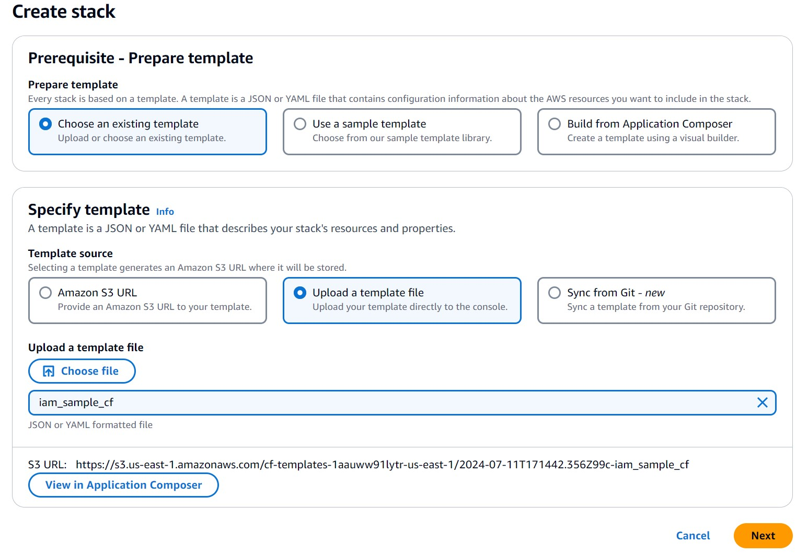
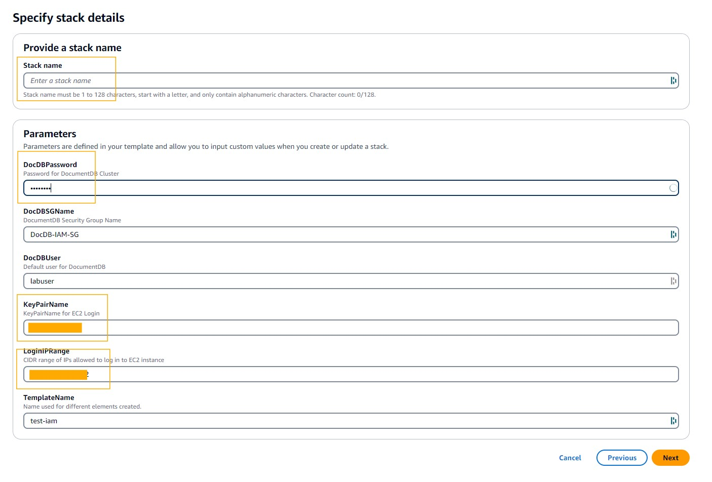
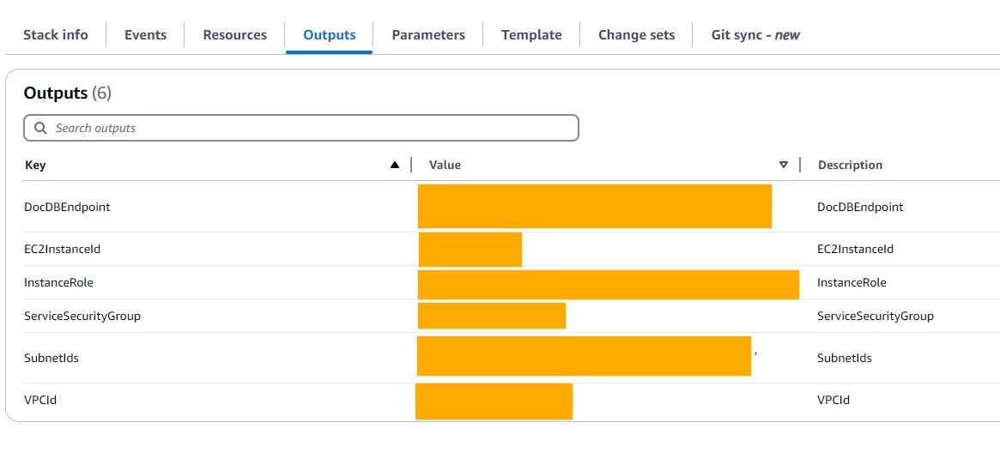
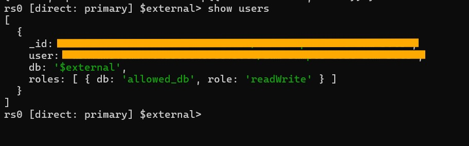
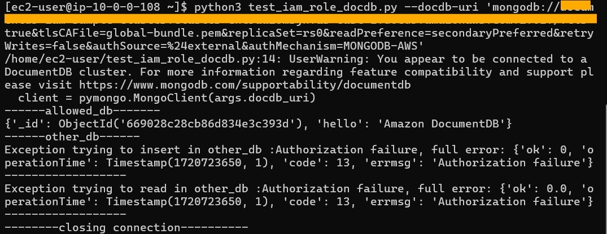

# Password-less  authentication to Amazon DocumentDB using IAM Roles

## Introduction

### Authentication using IAM identity

Amazon DocumentDB users and applications can use IAM users and roles to authenticate into an Amazon DocumentDB cluster. Amazon DocumentDB IAM authentication is a password-less authentication method in which user passwords are not stored in the Amazon DocumentDB cluster. Also, client applications do not send the password secrets to the Amazon DocumentDB cluster. Instead, client connections are authenticated by AWS STS using temporary security tokens. 

## Prerequisites

Create resources using the template file **iam_sample_cf.yaml** using instructions in [Selecting a stack template](https://docs.aws.amazon.com/AWSCloudFormation/latest/UserGuide/cfn-using-console-create-stack-template.html). 



Replace the following paremeters in the stack details screenshot



This will create resources needed for running this sample  including the following
    
* An [Amazon EC2 Instance](https://aws.amazon.com/pm/ec2/).

* An Amazon DocumentDB cluster with one db.r5.large instance.

* A security group that enables you to connect to your Amazon DocumentDB cluster from your Amazon EC2 instance. 

Once CloudFomation has created all resources, check the Outputs tab of the stack and note down all the Key-Value pairs



SSH into your ec2 instance using the following command

```
ssh -i <<KeyPairName_Parameter>>.pem ec2-user@<<InstancePublicIp_Output>>

```


## Install dependencies

1. Install mongo shell using the instructions in [Install the mongo shell](https://docs.aws.amazon.com/documentdb/latest/developerguide/get-started-guide.html#cloud9-mongoshell).

2. Install required python libraries for Amazon DocumentDB IAM authentication

```
sudo yum install pip
pip install 'pymongo[aws]'
```
## Run Sample Code

Get the certificate file needed for TLS communication with Amazon DocumentDB

```
wget https://truststore.pki.rds.amazonaws.com/global/global-bundle.pem
```

Log into mongoshell using the admin user

```
mongosh --ssl --host <<DocDBEndpoint_Output>>:27017 --sslCAFile global-bundle.pem --username labuser --password <<DocDBPassword_Parameter>> 
```
Create user in Amazon DocumentDB to link the IAM role attached to the EC2 instance which can found in the **InstanceRole** Output variable.
Once this command is execute, any AWS entity, which assumes the role identified by **InstanceRole** Output variable,permissions execute **read** and **write** operations on database **allowed_db** in this cluster.

```
use $external;
db.createUser(
    {
        user: "<<InstanceRole_Output>>",
            mechanisms: ["MONGODB-AWS"],
            roles: [ { role: "readWrite", db: "allowed_db" } ]
    }
);
```

Execute```show users``` command in mongoshell and confirm that the IAM Role has been linked to a user



Execute the Python script **test_iam_role_docdb.py**.  

```
python test_iam_role_docdb.py --docdb-uri 'mongodb://<<DocDBEndpoint_Output>>:27017/?tls=true&tlsCAFile=global-bundle.pem&replicaSet=rs0&readPreference=secondaryPreferred&retryWrites=false&authSource=%24external&authMechanism=MONGODB-AWS'
```

This script connects to the Amazon DocumentDB cluster with the IAM Role assumed by the EC2 instance we are running it from. The driver knows that it should autheticate using IAM credentials instead of native user credentials by a combination of the follwing three factors

* we dont pass any credentials in the Amazon DocumentDB URI
* **authSource=%24external** URI parameter
* **authMechanism=MONGODB-AWS** URI parameter

The script inserts a document and then reads a document from two databases in the cluster - **allowed_db** and **other_db**. The operations in **allowed_db** are successful and those in **other_db** fail with authorisation errors.




## Cleanup Resources

Delete the CloudFormation stack to delete all resolurces created in this sample.

