# How human users can authenticate to Amazon DocumentDB using IAM Users and IAM Roles

## Introduction

### Authentication using IAM identity

Amazon DocumentDB users and applications can use IAM users and roles to authenticate into an Amazon DocumentDB cluster. Amazon DocumentDB IAM authentication is a password-less authentication method in which user passwords are not stored in the Amazon DocumentDB cluster.


## Solution Overview

In the sample code, we demonstrate how human users can connect to DocumentDB without using native username-password mechanism by leveraging IAM authentication mechanism, in the following two ways

1. User is mapped to an IAM user and are given permanent AWS secrets. They use those credentials directly in the DocumentDB URI they provide to mongoshell.

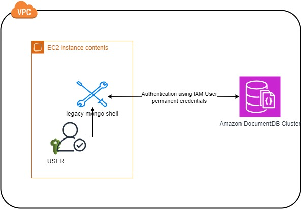

2. User is provided SSH access to an EC2 instance which has IAM Role attached to it. User launches mongoshell and authentic using this IAM Role.

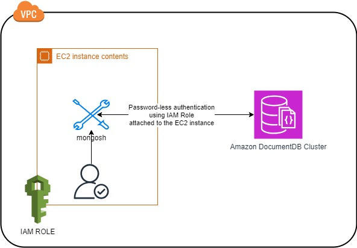


Of the two approaches, using IAM Roles is more secure since it uses temporary credentials isntead of permanent ones like IAM user does. However, IAM user can be convinient when a user is trying to connect to Amazon DocumentDB from their local work environment, like a laptop, and connecting via a VPN using mongoshell.

## Prerequisites

Create resources with the template file **iam_user_sample_cf.yaml** using instructions in [Selecting a stack template](https://docs.aws.amazon.com/AWSCloudFormation/latest/UserGuide/cfn-using-console-create-stack-template.html). 

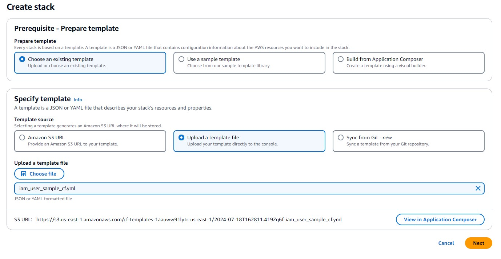

Replace the following paremeters in the stack details screen

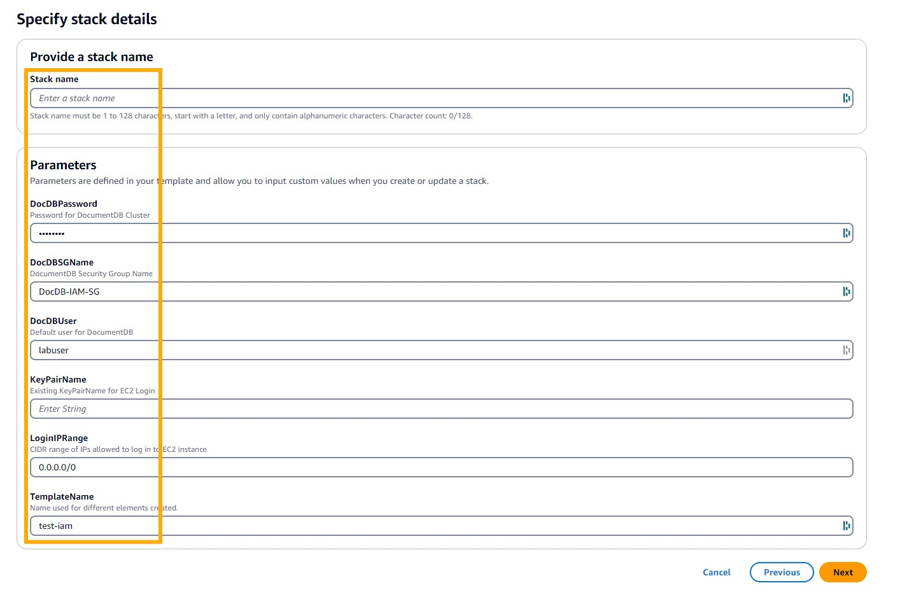

This will create resources needed for running this sample  including the following
    
* An [Amazon EC2 Instance](https://aws.amazon.com/pm/ec2/) with an IAM Role attached to it 

* An Amazon DocumentDB cluster with one db.r6g.large instance.

* A security group that enables you to connect to your Amazon DocumentDB cluster from your Amazon EC2 instance. 

* An IAM user with security credentials

Once CloudFomation has created all resources, check the Outputs tab of the stack and note down all the Key-Value pairs

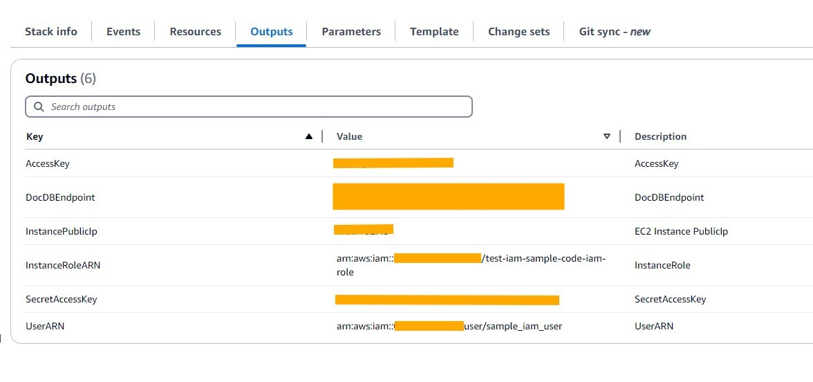

SSH into your ec2 instance using the following command

```
ssh -i <<KeyPairName_Parameter>>.pem ec2-user@<<InstancePublicIp_Output>>

```


## Steps 

1. Install mongo shell 

```
echo -e "[mongodb-org-5.0] \nname=MongoDB Repository\nbaseurl=https://repo.mongodb.org/yum/amazon/2013.03/mongodb-org/5.0/x86_64/\ngpgcheck=1 \nenabled=1 \ngpgkey=https://www.mongodb.org/static/pgp/server-5.0.asc" | sudo tee /etc/yum.repos.d/mongodb-org-5.0.repo
sudo yum install -y mongodb-org-shell
```

Check if mongoshell was installed

``` mongo --version
MongoDB shell version v5.0.28
Build Info: {
    "version": "5.0.28",
    "gitVersion": "a8f8b8e1e271f236e761d0138e2418d0a114c941",
    "openSSLVersion": "OpenSSL 1.0.2k-fips  26 Jan 2017",
    "modules": [],
    "allocator": "tcmalloc",
    "environment": {
        "distmod": "amazon",
        "distarch": "x86_64",
        "target_arch": "x86_64"
    }
}
```

Get the certificate file needed for TLS communication with Amazon DocumentDB

```
wget https://truststore.pki.rds.amazonaws.com/global/global-bundle.pem
```

Log into mongoshell using the admin user.

```
mongo --ssl --host <<DocDBEndpoint_Output>>:27017 --sslCAFile global-bundle.pem --username labuser --password <<DocDBPassword_Parameter>> 
```
Create user in Amazon DocumentDB to link the IAM User which can found in the **UserARN** Output variable.
Once this command is executed this IAM USer will have permissions execute **read** and **write** operations on database **allowed_db_1** in this cluster.

```
use $external;
db.createUser(
    {
        user: "<<UserARN_Output>>",
            mechanisms: ["MONGODB-AWS"],
            roles: [ { role: "readWrite", db: "allowed_db_1" } ]
    }
);
```
Create user in Amazon DocumentDB to link the IAM Role which can found in the **InstanceRoleARN** Output variable.
Once this command is executed this IAM Role will have permissions execute **read** and **write** operations on database **allowed_db_2** in this cluster.

```
use $external;
db.createUser(
    {
        user: "<<InstanceRoleARN_Output>>",
            mechanisms: ["MONGODB-AWS"],
            roles: [ { role: "readWrite", db: "allowed_db_2" } ]
    }
);
```
Execute ```show users``` command in mongoshell and confirm that each of the IAM User and Role has been linked to a user.

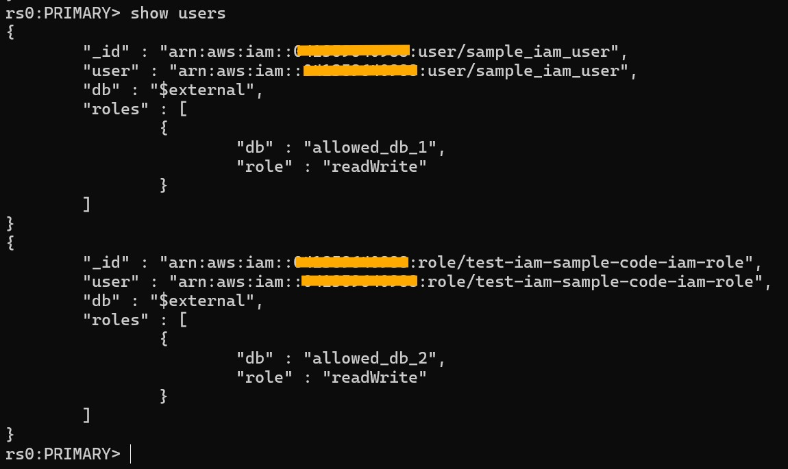

### Using IAM User
 
Log into mongoshell using the IAM User. To authenticate using IAM User, we use the follwing Amazon DocumentDB URI parameters - ```authSource``` as ```$external``` and ```authMechanism``` as ```MONGODB-AWS```. Further, we pass IAM User's **Access Key** as **username** and **Secret Access Key** as **password** in the Amazon DocumentDB URI - we need to URI escape any special characters in those values.

```
mongo 'mongodb://<<AccessKey_Output>>:<<SecretAccessKey_Output>>@<<DocDBEndpoint_Output>>:27017/test?authSource=%24external&authMechanism=MONGODB-AWS' --sslCAFile global-bundle.pem  --ssl
```

To check if connection was established using IAM user, run command ``` db.runCommand( { connectionStatus: 1, showPrivileges: true } )```. The output will indicate the user that is connected and the privileges they have.

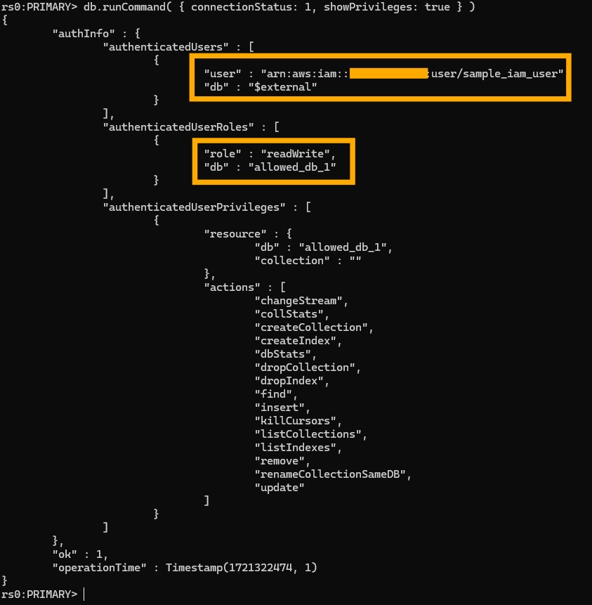

Insert a document in **allowed_db_1**.

```
use  allowed_db_1;
db.test.insert({x:1});
```
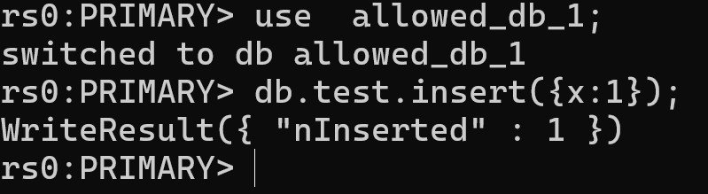

Since the IAM User has been granted privileges to allowed_db_1 database - ```roles: [ { role: "readWrite", db: "allowed_db_1" } ]```, the insert is succuessful.

Insert a document in **allowed_db_2**.

```
use  allowed_db_2;
db.test.insert({x:1});
```

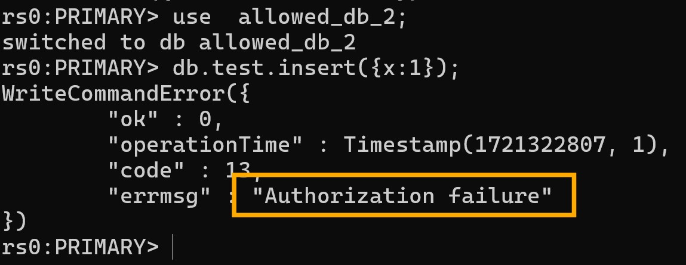

Since the IAM User has been granted privileges only to **allowed_db_1** database, the insert to **allowed_db_2** database fails with *"Authorization failure* error.

### Using IAM Role

Log into mongoshell using the IAM Role. To authenticate using IAM Role, we use the follwing Amazon DocumentDB URI parameters - ```authSource``` as ```$external``` and ```authMechanism``` as ```MONGODB-AWS```. *Note that we do not explicitly provide any username-password in the Amazon DocumentDB URI*. 

```
mongo 'mongodb://<<DocDBEndpoint_Output>>:27017/test?authSource=%24external&authMechanism=MONGODB-AWS' --sslCAFile global-bundle.pem  --ssl
```

To check if connection was established using IAM Role attached to the EC2 instance, run command ``` db.runCommand( { connectionStatus: 1, showPrivileges: true } )```. The output will indicate the user that is connected and the privileges they have.

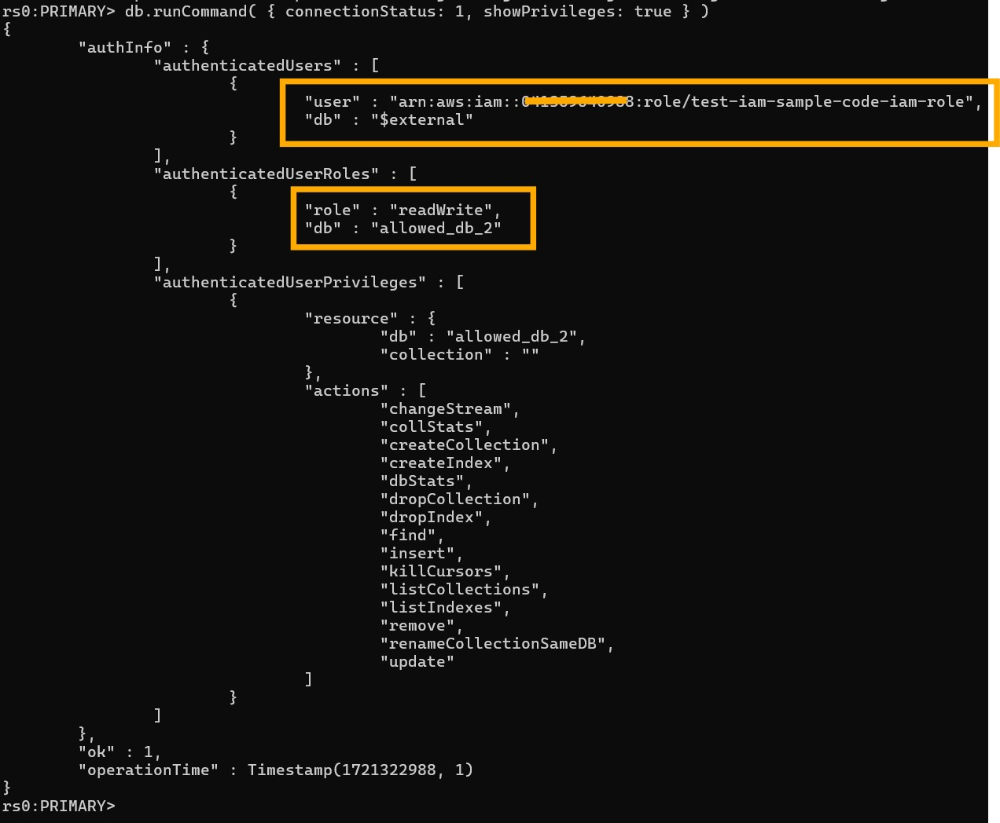

Insert a document in **allowed_db_2**.

```
use  allowed_db_2;
db.test.insert({x:1});
```

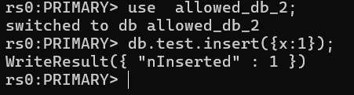

Since the IAM Role has been granted privileges to allowed_db_2 database - ```roles: [ { role: "readWrite", db: "allowed_db_2" } ]```, the insert is succuessful.

Insert a document in **.allowed_db_1**. 

```
use  allowed_db_1;
db.test.insert({x:1});
```

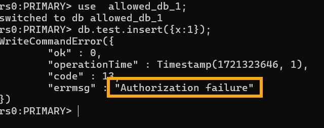

Since the IAM Role has been granted privileges only to **allowed_db_2** database, the insert to **allowed_db_1** database fails with *"Authorization failure* error.


## Cleanup Resources

Delete the CloudFormation stack to delete all resources created in this sample.

