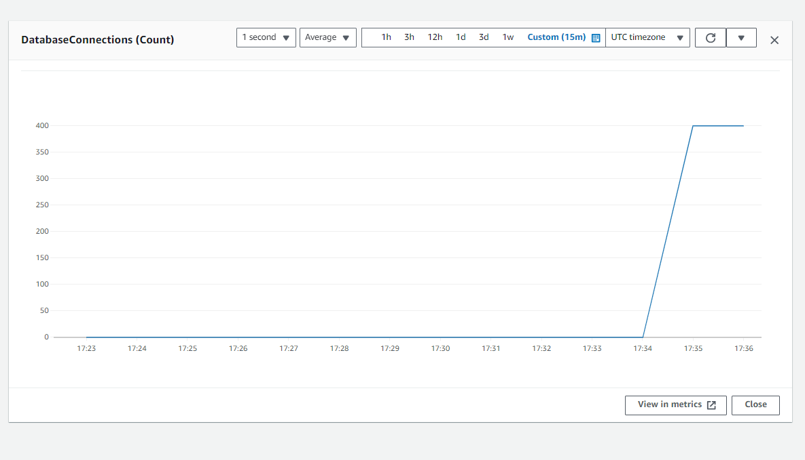
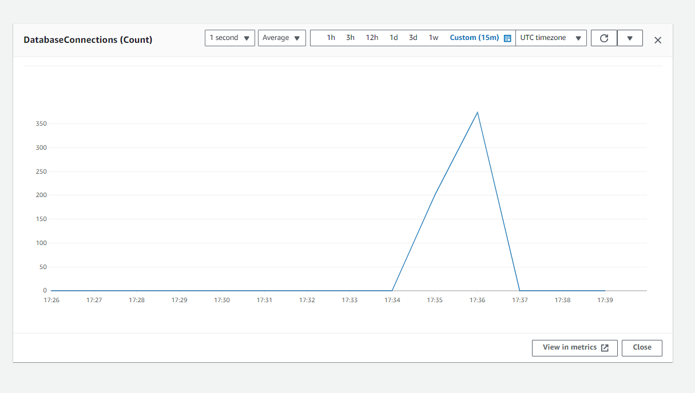
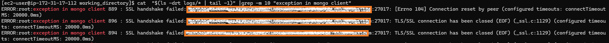
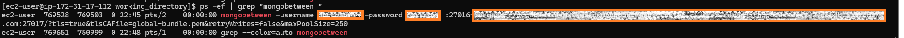
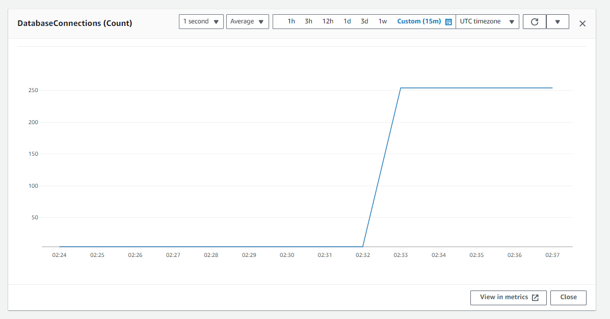
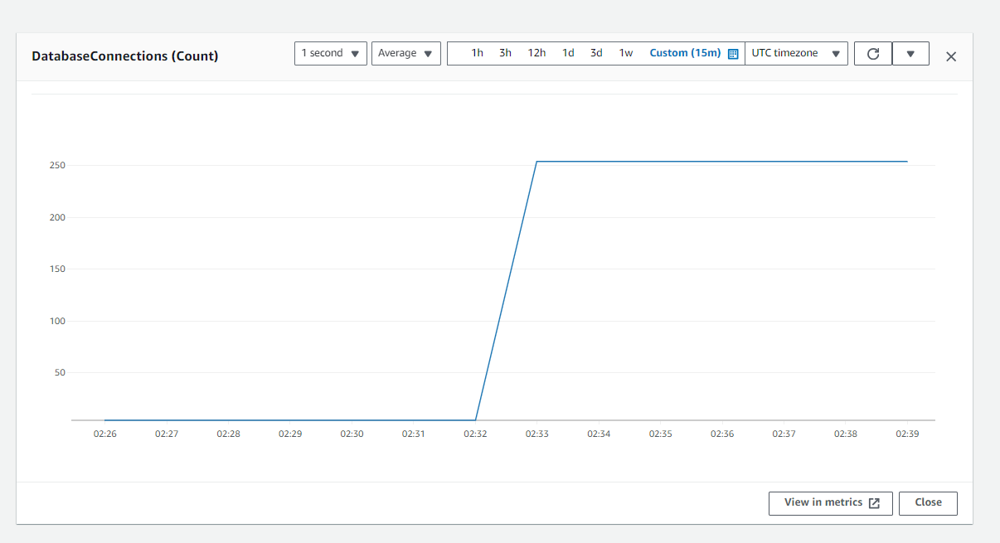
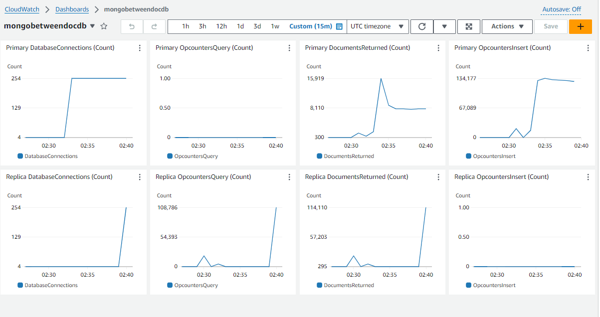

# Steps to run a MongoBetween connection proxy with Amazon DocumentDB

## Introduction

### Why do we need a connection proxy for Amazon DocumentDB

The maximum number of connections that DocumentDB currently supports is 30K per instance, and this is a hard limit. Scenarios where we see customers hitting these limits are with applications that are deployed using containers and have connections that are opened for a prolonged period of time. A common design solution to minimize the connections created on the database instances is to use a connection proxy layer. In this article, we introduce an open-source proxy solution and provide steps to install and deploy this proxy, along with the required application changes.

#### What is Mongobetween?

Mongobetween is a lightweight MongoDB connection pooler written in Golang. Its primary function is to handle a large number of incoming connections and multiplex them across a smaller connection pool to one or more DocumentDB clusters.
    
More resources:
    
1.  [Github code repo](https://github.com/coinbase/mongobetween/tree/master) 
2.  [Coinbase blog](https://www.coinbase.com/blog/scaling-connections-with-ruby-and-mongodb)

## Prerequisites

To implement this solution, you must have the following prerequisites:
    
* An [Amazon EC2 Instance](https://aws.amazon.com/pm/ec2/) where you can run Python scripts to generate database connections. You can use an existing Amazon EC2 instance or [create a new one] (https://docs.aws.amazon.com/AWSEC2/latest/UserGuide/EC2_GetStarted.html). Use a c5.18xlarge instance type for this test so that we have enough CPU for effective multi-processing. Configure appropriate network settings so that you are able to SSH into the instance.

* An Amazon DocumentDB cluster with at least two db.r6g.large instances. You can use an existing Amazon DocumentDB cluster or [create a new one](https://docs.aws.amazon.com/documentdb/latest/developerguide/db-cluster-create.html). This post assumes the default values for port (27017) and TLS (enabled) settings.

* A security group that enables you to connect to your Amazon DocumentDB 
cluster from your Amazon EC2 instance. You can use an existing security group or [create a new one](https://docs.aws.amazon.com/documentdb/latest/developerguide/get-started-guide.html#cloud9-security).You may also use the [Connect using Amazon EC2](https://docs.aws.amazon.com/documentdb/latest/developerguide/connect-ec2.html) feature to connect your Amazon DocumentDB cluster to your Amazon EC2 instance. 

* Python 3+. Modules pymongo

```
pip install pymongo
```

## Setup Mongobetween  in the  Amazon EC2 Instance

1.Install and Setup Mongobetween

* SSH into your EC2 instance
* Copy the files [```install_mongobetweeb.sh```](files/install_monogbetween.sh),[```mongo.go```](files/mongo.go),[```operations.go```](files/operations.go) to the EC2 instance home directory.
* Run the following command to make the ```install_mongobetweeb.sh``` file executable: 

        chmod 700 install_mongobetween.sh

* Execute the script - this may take a while.

        ./install_mongobetween.sh

2.Add ```mongobetween``` executable to the path.

Open the ```~/.bashrc``` file in your editor of choice, add the following lines to the end of the file, and save it.


    export GOPATH="$HOME/go"
    PATH="$GOPATH/bin:$PATH"


3.Check if Mongobetween has been installed. 

* Log out of your ec2 terminal and SSH back in.
* Execute the  command ```mongobetween -h``` and check if you see the follwing output
```
    [ec2-user@ip-172-31-29-240 ~]$ mongobetween -h
    Usage: mongobetween [OPTIONS] address1=uri1 [address2=uri2] ...
    -dynamic string
            File or URL to query for dynamic configuration
    -enable-sdam-logging
            Enable SDAM(Server Discovery And Monitoring) logging
    -enable-sdam-metrics
            Enable SDAM(Server Discovery And Monitoring) metrics
    -loglevel string
            One of: debug, info, warn, error, dpanic, panic, fatal (default "info")
    -network string
            One of: tcp, tcp4, tcp6, unix or unixpacket (default "tcp4")
    -password string
            MongoDB password
    -ping
            Ping downstream MongoDB before listening
    -pretty
            Pretty print logging
    -statsd string
            Statsd address (default "localhost:8125")
    -unlink
            Unlink existing unix sockets before listening
    -username string
            MongoDB username
```

## Create the test environment.

1. Create a directory for executing the test script.

        mkdir working_directory
        cd working_directory

2. Create a log directory for the output of the script.

        mkdir logs

3. Copy the file ```test_mongobetween.py``` to the working directory. This file contains Python code that spins off a number of processes, as provided by the argument ```--mongo-clients-count```. Each process creates its own collection, inserts 1000 documents into the primary instance of Amazon DocumentDB, as provided by the argument ```--docdb-uri```, and then reads the 1000 documents back from a replica.

3. Download the file ```global-bundle.pem``` in the working directory.

```
wget https://truststore.pki.rds.amazonaws.com/global/global-bundle.pem
```
## Run a Python script with a direct connection to a DocumentDB cluster with 200 concurrent processes.

4. Run a test with 200 concurrent processes.

```
python3 test_mongobetween.py  --mongo-clients-count 200  --docdb-uri '<<documentdb_uri>>'
```

* Wait for the following lines to be printed.

```
process starting -  196
process starting -  199
Completed execution of the script. Check the log directory for results.
```
* Check for exceptions.
```
cat  "$(ls -drt logs/* | tail -1)" |grep "exception in mongo client"
```
You should not be noticing any exceptions.

* Check for successful processes.

```
cat  "$(ls -drt logs/* | tail -1)" |grep "time taken by process" | wc -l
200
```

* Check the number of connections opened to the primary instance of your DocumentDB cluster from the monitoring dashboard.



* Check the number of connections opened to the replica instance from your DocumentDB cluster from the monitoring dashboard.



## Run a Python script with a direct connection to a DocumentDB cluster with 900 concurrent processes.

5. Now run the test with 900 concurrent processes.

```
python3  test_mongobetween.py  --mongo-clients-count 900  --docdb-uri '<<documentdb_uri>>'
```
* Wait for the following lines to be printed:
```process starting -  899
process starting -  898
process starting -  897
Completed execution of script. Checks logs directory for results.```
```
* Wait for at least 20 seconds, and then check for exceptions in log files.
```
cat  "$(ls -drt logs/* | tail -1)" |grep "exception in mongo client"
```

* You will notice exceptions.



These are the consequences of the large instances of Amazon DocumentDB R6G.large instances rejecting connections beyond its limit of 1700. By default, each Mongo client would open connections in increments of two up to a maximum of 100, as determined by the Mongo URI parameter. Each process in our code creates one Mongo client; hence, with 900 clients, the code is trying to open 1800 connections to the primary

```
maxPoolSize
The maximum number of connections in the connection pool. The default value is 100.

minPoolSize
The minimum number of connections in the connection pool. The default value is 0.

maxConnecting    
The maximum number of connections a pool may establish concurrently. The default value is 2
```

## Run the test script with MongoBeetween connection pooling.

1. Start the Mongobetween connection proxy process with a maximum of 300 connections to the Amazon DocumentDB cluster.

```mongobetween -username <<documentdb_user>> -password <<documentdb_password>> ":27016=<<documentdb_uri>>**&maxPoolSize=250**" &```

2. Open a new terminal and connect your EC2 instance. 

3. Check that Mongobetween is running.

```ps -ef | grep "mongobetween "```



4. Change to the working directory.
```
cd working_directory
```

5. Run the test with 900 concurrent processes, but the uri points to the Mongobetween proxy; note that the proxy uses port '''27016'''.

```python3  test_mongobetween.py  --mongo-clients-count 900  --docdb-uri 'mongodb://<<documentdb_user>>:<<documentdb_password>> @localhost:27016/?readPreference=secondaryPreferred&retryWrites=false'```

* Wait for the following line to be printed:
```
process starting -  895
process starting -  898
process starting -  899
Completed execution of script. Checks logs directory for results.
```
* Check for exceptions.

```cat  "$(ls -drt logs/* | tail -1)" |grep "exception in mongo client"```

You should not notice any exceptions since mongobetween is acting as a connection buffer between the application and the Amazon DocumentDB instances. As set by the ```maxPoolSize``` parameter in the uri supplied to mongobetween, you will notice only ~250 connections are open in the primary. But still, all 900 processes in our code are successful.

```
cat  "$(ls -drt logs/* | tail -1)" |grep "time taken by process" | wc -l
900
```

* Check the number of connections opened to the primary instance of your DocumentDB cluster from the monitoring dashboard.



* Check the number of connections opened to the replica instance from your DocumentDB cluster from the monitoring dashboard.



## Optional - verify connections and operation metrics. 

Change the instance(s) name and region, wherever applicable, in the ```dashboard``` file content.

Create a dashboard and [view/edit source](https://repost.aws/questions/QUzarTQVN5TgqAVeXR6_h6Bg/cloudwatch-dashboard-source-json). Copy the contents of the previous step and save the dashboard.



Note: This dashboard was created for a cluster with a topology of one primary and one replica instance. Change the content according to your cluster topology.

## Conclusion

If you can use Mongobetween effectively with your containerized applications, this will let you handle unplanned scaling events gracefully without exceptions being generated in the application. Please note that whenever you are sending more connections to Mongobetween than what is established to the DocumentDB cluster from MongoBetwen, you will notice increased latencies in the application. This is a trade-off that you need to consider in your application design, timeout settings, and exception handling.