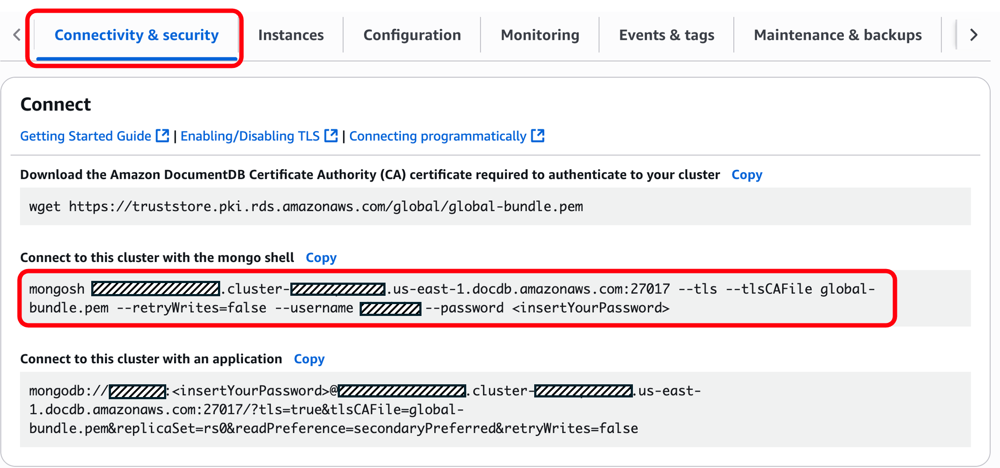

# Amazon Bedrock-Powered Amazon DocumentDB TSQL Plugin for mongosh
This AI-powered plugin for the MongoDB Shell allows you to run TSQL queries within mongosh sessions to Amazon DocumentDB and translate them into Amazon DocumentDB-compatible commands. It is powered by [Amazon Bedrock](https://aws.amazon.com/bedrock/) using [Claude 3 Haiku](https://www.anthropic.com/claude/haiku).

***For an offline, local version of this tool, see [Local Ollama-Powered Amazon DocumentDB TSQL Plugin for mongosh](https://github.com/aws-samples/amazon-documentdb-samples/tree/master/samples/mongosh-tsql-plugin/tsql-ollama-plugin).***

Both versions automatically handle [Supported MongoDB APIs, operations, and data types in Amazon DocumentDB](https://docs.aws.amazon.com/documentdb/latest/developerguide/mongo-apis.html), allow for customization of the prompt and LLM, and include a safety review mode to show generated code before execution.

## Prerequisites
1. Amazon DocumentDB cluster
2. AWS account with Amazon Bedrock access
3. AWS CLI v2
4. Python 3
4. Amazon Bedrock model access - Anthropic Claude 3 Haiku (`anthropic.claude-3-haiku-20240307-v1:0`)
5. Amazon DocumentDB compatibility tool (compat.py)
6. MongoDB Shell (mongosh)

## Download Amazon DocumentDB Compatibility Tool
The plugin utilizes the Amazon DocumentDB Compatibility Tool to create a list of supported operators in Amazon DocumentDB. The setup script will prompt you for the local location of `compat.py`. This is can be downloaded from the [amazon-documentdb-tools GitHub repository](https://github.com/awslabs/amazon-documentdb-tools/tree/master/compat-tool).

## Enable Bedrock Model Access
Ensure your AWS credentials have access to Anthropic Claude 3 Haiku (`anthropic.claude-3-haiku-20240307-v1:0`).

Visit the [Amazon Bedrock User Guide](https://docs.aws.amazon.com/bedrock/latest/userguide/model-access-modify.html) to learn how to add access to foundation models.

## Configure AWS credentials
```bash
aws configure
# Enter: Access Key, Secret Key, Region (us-east-1), Output format (json)
```

## Setup and install plugin
```bash
chmod 700 ./setup-bedrock-tsql.sh
./setup-bedrock-tsql.sh
```

## Launch mongosh and connect to Amazon DocumentDB

1. In the Amazon DocumentDB console, navigate to the cluster list and choose your cluster's identifier. In the Connectivity & security tab copy the **Connect** command for ***Connect to this cluster with the mongo shell***.



2. Paste the connection command into your terminal with the password updated. You should see an output similar to below if the plugin was successfully loaded

```bash
[ec2-user@ip-10-10-10-10 tsql-bedrock-plugin]$ mongosh my-cluster.cluster-abcdef123456.us-east-1.docdb.amazonaws.com:27017 --tls --tlsCAFile global-bundle.pem --retryWrites=false --username my-user --password --retryWrites=False
...
...
Amazon Bedrock-Powered Amazon DocumentDB TSQL Plugin for mongosh loaded!
Usage: tsql('SELECT * FROM users WHERE age > 25')
Review mode: tsql('SELECT * FROM users', {autoExecute: false})
rs0 [direct: primary] test> 
```

## Syntax

You use the plugin within mongosh while connected to Amazon DocumentDB via the `tsql()` command. Write your TSQL statements in the following format, enclosing it in single backticks (`` ` ``):

```javascript
tsql(`TSQL-STATEMENT-GOES-HERE`)
```

Enclose variables with single quotes (`'`):

```javascript
tsql(`SELECT * FROM table WHERE field = 'search-filter';`)
```

Statements can span multiple lines:

```javascript
tsql(`SELECT * FROM table 
WHERE field = 'search-filter';`)
```

You can set statments as JavaScript variables and pass them to `tsql`:
```javascript
let statement = "SELECT * FROM table WHERE field = 'search-filter';"
tsql(statement)
```

## Review Mode
You can pass `autoExecute: false` to your `tsql` statements to run the query in reveiw mode. This will return the mongosh command without automatically executing against your namespaces.
```javascript
// Review mode - shows generated code without executing
tsql(`SELECT * FROM customers WHERE age > 25`, {autoExecute: false})

// Output:
mongosh: db.customers.find({age: {$gt: 25}})
> REVIEW MODE - COMMANDS NOT EXECUTED
```

#### Auto-Execute Mode (default)
```javascript
// Direct execution (default)
tsql(`SELECT * FROM customers WHERE age > 25`)
```

## Example Usage

### 1. Select
```javascript
tsql(`SELECT *
FROM customers
WHERE trafficfrom = 'mysite.com'
ORDER BY trans_timestamp DESC;`)

//Output
mongosh: db.customers.find({trafficfrom: 'mysite.com'}).sort({trans_timestamp: -1});
```

### 2. Select
```javascript
tsql(`SELECT custid, trafficfrom, device, touchproduct
| FROM customers
| WHERE device = 'app_mobile'
| AND trans_timestamp >= '2025-09-20';`)

//Output
mongosh: db.customers.find({
  device: 'app_mobile',
  trans_timestamp: { $gte: new Date('2025-09-20') }
}, {
  custid: 1,
  trafficfrom: 1,
  device: 1,
  touchproduct: 1
})
```

### 3. Update
```javascript
tsql(`UPDATE customers
SET 
    trafficfrom = 'mysite.com',
    device = 'phone',
    product = 111
WHERE _id = '650b0a714c728dcb47f97853';`)

//Output
mongosh: db.customers.updateOne(
  { _id: ObjectId("650b0a714c728dcb47f97853") },
  { $set: {
    trafficfrom: 'mysite.com',
    device: 'phone',
    product: 111
  }}
)
```

### 4. Insert
```javascript
tsql(`INSERT INTO customers 
(custid, trafficfrom, url, device, product, trans_timestamp)
VALUES 
(22, 'mysite.com', 'new_orders', 'app_mobile', 126, '2025-09-20T15:06:24.506260');`)

//Output
mongosh: db.customers.insertOne({
    custid: 22,
    trafficfrom: 'mysite.com',
    url: 'new_orders',
    device: 'app_mobile',
    product: 126,
    trans_timestamp: new Date('2025-09-20T15:06:24.506260')
})
```

### 5. Delete
```javascript
tsql(`DELETE FROM customers
WHERE _id = '650b0bfa938593cca4d05b30';`)

//Output
mongosh: db.customers.deleteOne({_id: '650b0bfa938593cca4d05b30'});
```

### 6. Regex
```javascript
tsql(`SELECT * FROM customers
WHERE trafficfrom LIKE '%.com';`)

//Output
mongosh: db.customers.find({
  trafficfrom: {
    $regex: /\.com$/
  }
});
```

### 7. $lookup / inner join
```javascript
tsql(`SELECT 
    p.category,
    COUNT(o.order_number) as total_orders,
    SUM(o.quantity) as total_quantity_ordered,
    SUM(o.quantity * p.price) as total_revenue
FROM orders o
INNER JOIN products p 
    ON o.product_id = p._id
GROUP BY p.category
ORDER BY total_revenue DESC;`)

//Output
mongosh: db.orders.aggregate([
  {
    $lookup: {
      from: "products",
      localField: "product_id",
      foreignField: "_id",
      as: "product"
    }
  },
  {
    $unwind: "$product"
  },
  {
    $group: {
      _id: "$product.category",
      total_orders: {$sum: 1},
      total_quantity_ordered: {$sum: "$quantity"},
      total_revenue: {$sum: {$multiply: ["$quantity", "$product.price"]}}
    }
  },
  {
    $sort: {
      total_revenue: -1
    }
  }
])
```

## Amazon Bedrock Token Usage (Estimate)
| Component | Token Count |
|-----------|-------------|
| Base prompt text | ~50 tokens |
| TSQL query | ~10-50 tokens (variable) |
| Compatibility list | ~20-100 tokens |
| Prompt examples | ~300-350 tokens |
| **TOTAL** | **~380-550 tokens per request** |

## Customizing the Prompt

You can modify the prompt in `tsql-bedrock-plugin.js` to improve results for your specific use case:

```javascript
// Find this section in the file and modify as needed:
const prompt = `Convert this TSQL query to MongoDB JavaScript code...

// Add your own examples:
TSQL: SELECT * FROM your_table_name
MongoDB: db.your_table_name.find()

// Add domain-specific instructions:
Always use camelCase for field names.
Prefer $match over find() for complex queries.
`;
```

## Important Disclaimers

⚠️ **Review All Generated Code**: This tool uses AI to translate queries and may produce incorrect results. Always review the generated MongoDB code before executing it on production data.

⚠️ **Test First**: Test generated queries on sample data before running on production databases.

⚠️ **Complex Queries**: More complex TSQL queries may require manual review and adjustment of the generated MongoDB code.

**Best Practices:**
- **Use review mode**: `tsql(query, {autoExecute: false})`
- Start with simple queries to understand the tool's behavior
- Keep a backup of important data before running generated queries
- Use the tool as a starting point, not a final solution
- Verify results match your expectations
