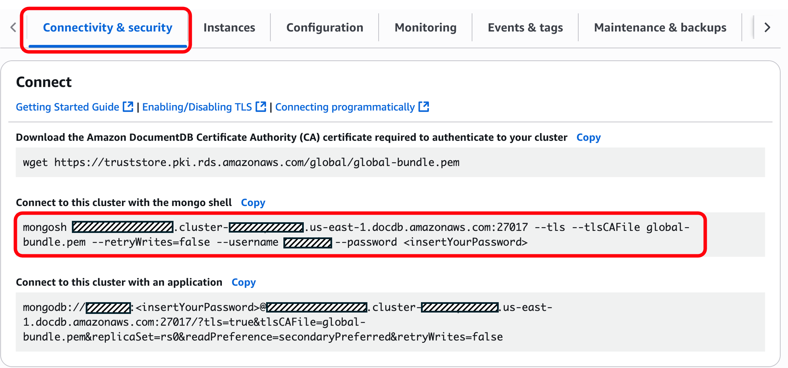

# Local Ollama-Powered Amazon DocumentDB TSQL Plugin for mongosh
This AI-powered plugin for the MongoDB Shell allows you to run TSQL queries within mongosh sessions to Amazon DocumentDB and translate them into Amazon DocumentDB-compatible commands. It is powered by [Ollama](https://ollama.com/) and runs locally on your machine.

***This version is designed to be run offline against an LLM loaded locally on your machine. All AI processing happens locally with no API costs. Vist [Amazon Bedrock-Powered Amazon DocumentDB TSQL Plugin for mongosh](https://github.com/aws-samples/amazon-documentdb-samples/tree/master/samples/mongosh-tsql-plugin/tsql-bedrock-plugin) for the version powered by Amazon Bedrock and Claude 3 Haiku.***

Both versions automatically handle [Supported MongoDB APIs, operations, and data types in Amazon DocumentDB](https://docs.aws.amazon.com/documentdb/latest/developerguide/mongo-apis.html), allow for customization of the prompt and LLM, and include a safety review mode to show generated code before execution.

## Prerequisites
1. Amazon DocumentDB cluster
2. Python 3
3. 4GB local disk space (for [CodeLlama 7B](https://ollama.com/library/codellama:7b) model - 3.8GB)
3. Amazon DocumentDB compatibility tool (compat.py)
4. MongoDB Shell (mongosh)

## Download Amazon DocumentDB Compatibility Tool
The plugin utilizes the Amazon DocumentDB Compatibility Tool to create a list of supported operators in Amazon DocumentDB. The setup script will prompt you for the local location of `compat.py`. This is can be downloaded from the [amazon-documentdb-tools GitHub repository](https://github.com/awslabs/amazon-documentdb-tools/tree/master/compat-tool).

## Setup and install plugin
This installation script installs [Ollama](https://ollama.com/) and the [CodeLlama 7B](https://ollama.com/library/codellama:7b) model which requires ~3.8GB of disk space. ***Install time depends on your download speed.***

```bash
chmod 700 ./setup-ollama-tsql.sh
./setup-ollama-tsql.sh
```

## Launch mongosh and connect to Amazon DocumentDB

1. In the Amazon DocumentDB console, navigate to the cluster list and choose your cluster's identifier. In the Connectivity & security tab copy the **Connect** command for ***Connect to this cluster with the mongo shell***.



2. Paste the connection command into your terminal with the password updated. You should see an output similar to below if the plugin was successfully loaded

```terminal
[ec2-user@ip-10-10-10-10 tsql-bedrock-plugin]$ mongosh my-cluster.cluster-abcdef123456.us-east-1.docdb.amazonaws.com:27017 --tls --tlsCAFile global-bundle.pem --retryWrites=false --username my-user --password --retryWrites=False
...
...
Local Ollama-Powered Amazon DocumentDB TSQL Plugin for mongosh loaded!
Usage: tsql('SELECT * FROM users WHERE age > 25')
Review mode: tsql('SELECT * FROM users', {autoExecute: false})
rs0 [direct: primary] test> 
```

## Syntax

You use the plugin within mongosh while connected to Amazon DocumentDB via the `tsql()` command. Write your TSQL statements in the following format, enclosing it in single backticks (`` ` ``):

```javascript
tsql(`TSQL-STATEMENT-GOES-HERE`)
```

Enclose variables with single quotes (`'`):

```javascript
tsql(`SELECT * FROM table WHERE field = 'search-filter';`)
```

Statements can span multiple lines:

```javascript
tsql(`SELECT * FROM table 
WHERE field = 'search-filter';`)
```

You can set statments as JavaScript variables and pass them to `tsql`:
```javascript
let statement = "SELECT * FROM table WHERE field = 'search-filter';"
tsql(statement)
```

## Review Mode
You can pass `autoExecute: false` to your `tsql` statements to run the query in reveiw mode. This will return the mongosh command without automatically executing against your namespaces.
```javascript
// Review mode - shows generated code without executing
tsql(`SELECT * FROM customers WHERE age > 25`, {autoExecute: false})

// Output:
mongosh: db.customers.find({age: {$gt: 25}})
> REVIEW MODE - COMMANDS NOT EXECUTED
```

#### Auto-Execute Mode (default)
```javascript
// Direct execution (default)
tsql(`SELECT * FROM customers WHERE age > 25`)
```

## Example Usage

### 1. Select
```javascript
tsql(`SELECT *
FROM customers
WHERE trafficfrom = 'mysite.com'
ORDER BY trans_timestamp DESC;`)

//Output
mongosh: db.customers.find({trafficfrom: "mysite.com"}).sort({trans_timestamp: -1})
```

### 2. Select with Projection
```javascript
tsql(`SELECT custid, trafficfrom, device, touchproduct
FROM customers
WHERE device = 'app_mobile'
AND trans_timestamp >= '2025-09-20';`)

//Output
mongosh: db.customers.find({ device: "app_mobile", trans_timestamp: { $gte: new Date("2025-09-20") } })
```

### 3. Aggregation with GROUP BY
```javascript
tsql(`SELECT device, COUNT(*) as visit_count
FROM customers
GROUP BY device;`)

//Output
mongosh: db.customers.aggregate([{$group: {_id: "$device", visit_count: {$sum: 1}}}])
```

## Customizing the Model
The plugin uses CodeLlama 7B by default, but you can switch to other models:

```bash
# Install a different model
ollama pull codellama:13b       # Larger, more accurate (7GB)
ollama pull llama2:7b           # General purpose alternative
ollama pull mistral:7b          # Faster, smaller model

# Edit tsql-ollama-plugin.js and change the model line:
model: 'codellama:13b',  # Changed from 'codellama:7b'
```

**Model Trade-offs:**
- **Larger models** (13B+): More accurate but slower and uses more memory
- **Smaller models** (7B): Faster but may be less accurate on complex queries

## Customizing the Prompt

You can modify the prompt in `tsql-ollama-plugin.js` to improve results for your specific use case:

```javascript
// Find this section in the file and modify as needed:
const prompt = `Convert this TSQL query to MongoDB JavaScript code...

// Add your own examples:
TSQL: SELECT * FROM your_table_name
MongoDB: db.your_table_name.find()

// Add domain-specific instructions:
Always use camelCase for field names.
Prefer $match over find() for complex queries.
`;
```

## Important Disclaimers

⚠️ **Review All Generated Code**: This tool uses AI to translate queries and may produce incorrect results. Always review the generated mongosh code before executing it against production data.

⚠️ **Test First**: Test generated queries on sample data before running against production databases.

⚠️ **Complex Queries**: More complex TSQL queries may require manual review and adjustment of the generated mongosh code.

**Best Practices:**
- **Use review mode**: `tsql(query, {autoExecute: false})`
- Start with simple queries to understand the tool's behavior
- Keep a backup of important data before running generated queries
- Use the tool as a starting point, not a final solution
- Verify results match your expectations