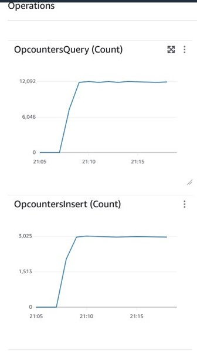
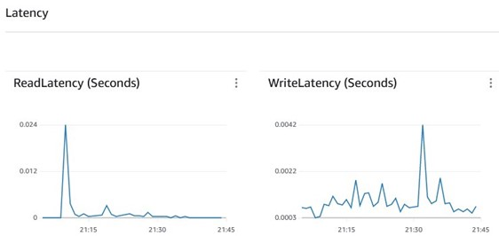
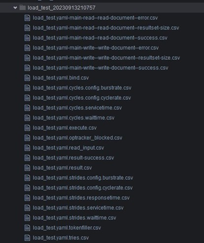

# Steps to run NoSQLBench against Amazon DocumentDB

## Introduction

### Motivation : Why do load testing

1. Sizing - Simulate an known workload and test it against Amazon DocumentDB to get an idea of what would be the ideal instance sizes required to sustain an expected performance from the database 
    1. pricing
    2. migration
    3. new workload introduction 
2. Create mock scenarios to troubleshoot any suspected database issues

#### What is NoSQLBench?

NoSQLBench is a performance testing tool for the NoSQL ecosystem.
    
NoSQLBench brings advanced testing capabilities into one tool :

*  You can run common testing workloads directly from the command line. 
*  You can generate virtual data sets of arbitrary size, with deterministic data and statistically shaped values.
*  You can design custom workloads that emulate your application, contained in a single file, based on statement templates - no IDE or coding required.
*  You can immediately plot your results in a docker and grafana stack on Linux with a single command line option.
* When needed, you can open the access panels and rewire the runtime behavior of NoSQLBench to do advanced testing, including a full scripting environment with Javascript.
    
More resources :
    
1.  [Github code repo](https://github.com/nosqlbench/nosqlbench/tree/main) 
2.  [Read the Docs](http://docs.nosqlbench.io/)

## Prerequisites

To implement this solution, you must have the following prerequisites:
    
* An [AWS Cloud9](https://aws.amazon.com/cloud9/) environment where you can load sample data to your Amazon DocumentDB cluster and run Python scripts to generate database load. You can use an existing AWS Cloud9 environment or [create a new one](https://docs.aws.amazon.com/documentdb/latest/developerguide/get-started-guide.html#cloud9-environment).
* A security group that enables you to connect to your Amazon DocumentDB cluster from your AWS Cloud9 environment. You can use an existing security group or [create a new one](https://docs.aws.amazon.com/documentdb/latest/developerguide/get-started-guide.html#cloud9-security).
* An Amazon DocumentDB cluster with at least one t3.medium instance. You can use an existing Amazon DocumentDB cluster or [create a new one](https://docs.aws.amazon.com/documentdb/latest/developerguide/db-cluster-create.html). This post assumes the default values for port (27017) and TLS (enabled) settings.
* A mongo shell (or similar tool) to perform administrative actions on the database.

## Setup NoSQLBench  environment for Amazon DocumentDB in Cloud9

1. Install Java 17 –

    ```
    sudo yum install java-17-amazon-corretto-devel
    ```

2. *Optional* - To connect to TLS enabled cluster (default setting) use steps to create java certificate file .Create a java trust-store using [_instructions_](https://docs.aws.amazon.com/documentdb/latest/developerguide/connect_programmatically.html)
    1. mkdir /tmp/certs
    2. create a file **create-truststore.sh** and copy script,listed below, after filling in the placeholders

        ```
        mydir=/tmp/certs
        truststore=${mydir}/rds-truststore.jks
        storepassword=<<password>>
        curl -sS "https://truststore.pki.rds.amazonaws.com/global/global-bundle.pem" > ${mydir}/global-bundle.pem
        awk 'split_after == 1 {n++;split_after=0} /-----END CERTIFICATE-----/ {split_after=1}{print > "rds-ca-" n ".pem"}' < ${mydir}/global-bundle.pem
        for CERT in rds-ca-*; do
        alias=$(openssl x509 -noout -text -in $CERT | perl -ne 'next unless /Subject:/; s/.*(CN=|CN = )//; print')
        echo "Importing $alias"
        keytool -import -file ${CERT} -alias "${alias}" -storepass ${storepassword} -keystore ${truststore} -noprompt
        rm $CERT
        done
        rm ${mydir}/global-bundle.pem
        echo "Trust store content is: "
        keytool -list -v -keystore "$truststore" -storepass ${storepassword} | grep Alias | cut -d " " -f3- | while read alias
        do
        expiry=`keytool -list -v -keystore "$truststore" -storepass ${storepassword} -alias "${alias}" | grep Valid | perl -ne 'if(/until: (.*?)\n/) { print "$1\n"; }'`
        echo " Certificate ${alias} expires in '$expiry'"
        done
        ```

    3. chmod 777 **create-truststore.sh**
    4. ./create-truststore.sh
3. Download the nb5 jar from Github
    * wget [https://github.com/nosqlbench/nosqlbench/releases/download/5.17.3-release/nb5.jar](https://github.com/nosqlbench/nosqlbench/releases/download/5.17.3-release/nb5.jar)
    * chmod 777 nb5.jar

## Gather testing requirements

1. Initial data loading
2. CRUD operations and their ratios
3. Sample document(s) from source database collection – should be of same size as actual production average document size

### Example of gathering requirements for a load test

1. Load 1 million document in DocumentDB database
2. Run a load test with 50 inserts per seconds and 200 reads per seconds for 30 minutes
3. Sample document structure

        
        {
        "_id" : 1
        "name"   : "Alice Brown",
        "sku"    : "54321",
        "price"  : 199.95,
        "shipTo" : {
        "name" : "Bob Brown",
        "address" : "456 Oak Lane",
        "city" : "Pretendville",
        "state" : "HI",
        "zip"   : "98999"
        },
        "billTo" : {
        "name" : "Alice Brown",
        "address" : "456 Oak Lane",
        "city" : "Pretendville",
        "state" : "HI",
        "zip"   : "98999"
        }
        }
        

1. No index other than _id field
2. Read is based on _id field

## Create test artifacts and run tests

1. Create the any indices that you many need to run the queries, on target database – need all the indices declared to get accurate query performance.
2. Create workload YAML file – refer to [_sample_](https://github.com/nosqlbench/nosqlbench/blob/main/adapter-mongodb/src/main/resources/activities/mongodb-crud-basic.yaml). Plug in in the queries in appropriate [blocks.](https://docs.nosqlbench.io/workloads-101/06-op-blocks/). Check section **Step 1 - Generate synthetic data - 1 million documents** for an example. This YAML file defines your workload.
    *[workload-template-layout](https://docs.nosqlbench.io/workloads-101/02-workload-template-layout/)
    * [data-bindings](https://docs.nosqlbench.io/workloads-101/03-data-bindings/)
    * [core parameters in file](https://docs.nosqlbench.io/user-guide/core-op-fields/)
    * [core parameters for command line](https://docs.nosqlbench.io/user-guide/core-activity-params/) ( needed to run the file)
    * group block by tags - all queries you want to run together must be **tagged** using a common regex , for example **main**-write and **main**-read to run write read statements together.
3. Change the **_id** field and any fields having indices to refer to an appropriate binding. The rest of the fields can be static as long as they contain representative static data.
4. Run the workload yaml file using **nb5.jar** using the following syntax

        java -Djavax.net.ssl.trustStore=<<truststore_location>> -Djavax.net.ssl.trustStorePassword=<<truststore_password>> -jar nb5.jar run driver=mongodb yaml=<<yaml_file>> connection="<<DocumentDBURL>>" tags=<<target_tags>> database=<<target_db>> cycles=<<total_num_operations>> threads=auto errors=timer,warn -v --report-csv-to <<folder_to_store_results>> --progress console:30s


### Example of running a load test  using the requirements gathered in previous section

#### Step 1 - Generate synthetic data - 1 million documents 

1. Create a **rampup.yaml** configuration  file, plug in the query(with binding reference) in the **rampup** phase ( nested within blocks) – copy content below :

        
        bindings:
          seq_key: CycleRange(1,<<docscount:10000000>>); 
        
        blocks:
          rampup:
            ops:
              write-document: >2
                {
                  insert: "nosqlbench_test_collection",
                  documents: [
                    { 
                      "_id" : {seq_key}
                      "name"   : "Alice Brown",
                      "sku"    : "54321",
                      "price"  : 199.95,
                      "shipTo" : { 
                        "name" : "Bob Brown",
                        "address" : "456 Oak Lane",
                        "city" : "Pretendville",
                        "state" : "HI",
                        "zip"   : "98999" 
                        },
                       "billTo" : {
                        "name" : "Alice Brown",
                        "address" : "456 Oak Lane",
                        "city" : "Pretendville",
                        "state" : "HI",
                        "zip"   : "98999" 
                        }
                    }
                  ]
                }
        

1. Run the following command from terminal. Note the parameter cycles control the total number of rows to be inserted - we need to insert 1M documents , hence **cycles** is set to 1M

    SSL 


        java -Djavax.net.ssl.trustStore=/tmp/certs/rds-truststore.jks -Djavax.net.ssl.trustStorePassword=password -jar nb5.jar run driver=mongodb yaml=rampup.yaml connection="**<<DocumentDBURL>>**" tags=block:"rampup.*" database=nosqlbench_db cycles=1M threads=auto errors=timer,warn -v --report-csv-to ~/environment/tmp/csv/$(date +%Y%m%d%H%M%S) --progress console:30s


    Without SSL 


        java -jar nb5.jar run driver=mongodb yaml=rampup.yaml connection="**<<DocumentDBURL>>**" tags=block:"rampup.*" database=nosqlbench_db cycles=1M threads=auto errors=timer,warn -v --report-csv-to ~/environment/tmp/csv/$(date +%Y%m%d%H%M%S) --progress console:30s


##### Expected Output

Check , using Mongo Shell, if 1 million document were inserted into the **nosqlbench_test_collection** collection.

#### Step 2 - Run a load test with 50 inserts per seconds and 200 reads per seconds for 30 minutes

1. Create a **load_test.yaml** configuration  file, plug in the query(with binding reference) in the **main-\*** phase ( nested within blocks) – copy content below for running sample. Note
    1. **params.ratio** controls the ratio of the different operations at any given . In this case there is a 1:4 write to read ratio (50:200)
    2. For binding **write_seq_key** we are using an additional function **Div(5)** - this helps in a continuous _id sequences for writing. Read the nosqlbench documents to understand the bindings more

        ```
        bindings:
          write_seq_key: Div(5);CycleRange(1000001,<<docscount: 2000000>>);  
          read_seq_key: Uniform(1,<<docscount:1000000>>);
        
        blocks:
          main-write:
            params:
              ratio: 1
              instrument: true
            ops:
              write-document: >2
                {
                  insert: "nosqlbench_test_collection",
                  documents: [
                    { 
                      "_id" : {write_seq_key},
                      "name"   : "Alice Brown",
                      "sku"    : "54321",
                      "price"  : 199.95,
                      "shipTo" : { 
                        "name" : "Bob Brown",
                        "address" : "456 Oak Lane",
                        "city" : "Pretendville",
                        "state" : "HI",
                        "zip"   : "98999" 
                        },
                       "billTo" : {
                        "name" : "Alice Brown",
                        "address" : "456 Oak Lane",
                        "city" : "Pretendville",
                        "state" : "HI",
                        "zip"   : "98999" 
                        }
                    }
                  ]
                }
          main-read:
            params:
              ratio: 4
              instrument: true
            ops:
              read-document: >2
                {
                  find: "nosqlbench_test_collection",
                  filter: { _id: {read_seq_key} }
                }  
        ```

    Note : You may also separate out each query into its own file and execute them in parallel. In that case **cyclerate** (see below)  for each file would determine ratio


1. Run the following command from terminal. Note
    1. the parameters **cycles** and **cyclerate** control the duration of the run (total duration = cycles/cyclerate in seconds)
    2. **cyclerate** controls the rate of operations per second – 50 inserts + 200reads=250 total operations per second
    3. Total duration = 30 mins, hence **total cycles** needed – 250*60*30=450000

    SSL 


        java -Djavax.net.ssl.trustStore=/tmp/certs/rds-truststore.jks -Djavax.net.ssl.trustStorePassword=password -jar nb5.jar run driver=mongodb yaml=**load_test.yaml** connection="**<<DocumentDBURL>>**" tags=block:"main-*.*" database=nosqlbench_db cycles=450000 cyclerate=250 threads=auto errors=timer,warn -v --report-csv-to ~/environment/tmp/csv/$(date +%Y%m%d%H%M%S) --progress console:30s


    Without SSL 


        java -jar nb5.jar run driver=mongodb yaml=**load_test.yaml** connection="**<<DocumentDBURL>>**" tags=block:"main-*.*" database=nosqlbench_db cycles=450000  cyclerate=250 threads=auto errors=timer,warn -v --report-csv-to ~/environment/tmp/csv/$(date +%Y%m%d%H%M%S) --progress console:30s


#### Expected Output

1. Check , using Mongo Shell, if 90000 additional document were inserted into the collection.Total count should be 1090000.
2. Also, validate CloudWatch Metrics and check if you getting 50 Document Inserts(**OpscounterInsert**) per second and 200 Document Reads(**OpscounterQuery**) per second

### Results

Check Cloudwatch DocumentDB metrics to validate if the ratio is being maintained as intended.



Buffer  Cache metrics


Read Write response times




## Appendix

### Application side metrics

Once the test is over, find the results in folder **~/environment/****tmp****/csv/load_test_$(date +%Y%m%d%H%M%S)**

1. Each named block, with **instrument** as true, will have its own set of metrics
2. There will also be overall test metrics


1. [_https://docs.nosqlbench.io/getting-started/04-reading-metrics/_](https://docs.nosqlbench.io/getting-started/04-reading-metrics/)
2. **metric: result** This is the primary metric that should be used to get a quick idea of the throughput and latency for a given run. It encapsulates the entire operation life cycle ( ie. bind, execute, get result back ).
3. **metric: result-success** This metric shows whether there were any errors during the run. You can confirm that the count is equal to the number of cycles for the run if you are expecting or requiring zero failed operations.
4. **metric:** **resultset-size** For read workloads, this metric shows the size of result sent back to NoSQLBench from the server. This is useful to confirm that you are reading rows that already exist in the database.

Let’s look at the results generated from our test

File : load_test.yaml-main-write--write-document--success.csv

 ```
t,count,max,mean,min,stddev,p50,p75,p95,p98,p99,p999,mean_rate,m1_rate,m5_rate,m15_rate,rate_unit,duration_unit
        
1694641083,90000,0.000000,0.000000,0.000000,0.000000,0.000000,0.000000,0.000000,0.000000,0.000000,0.000000,49.942253,47.572272,49.601154,55.295730,calls/second,nanoseconds
        
1694641083,90000,0.000000,0.0
```

### Sample yaml file


Ratio in each named block will determine the overall share of the operation at any given moment.

Link [_https://github.com/nosqlbench/nosqlbench/blob/main/adapter-mongodb/src/main/resources/activities/mongodb-crud-basic.yaml_](https://github.com/nosqlbench/nosqlbench/blob/main/adapter-mongodb/src/main/resources/activities/mongodb-crud-basic.yaml)

### Sample bindings

* Documentation: [_https://docs.nosqlbench.io/reference/bindings/_](https://docs.nosqlbench.io/reference/bindings/)
* MongoDB adapter samples: [_https://github.com/nosqlbench/nosqlbench/tree/main/adapter-mongodb/src/main/resources/activities_](https://github.com/nosqlbench/nosqlbench/tree/main/adapter-mongodb/src/main/resources/activities)
* Structure of Bindings
    * Seed -> Function (Function will produce consistent value with same seed)
    * Default seed – cycle number
    * Override seed to control output
* Samples
    * seq_key: Mod(<<docscount:10>>); ToString() -> String   resets every 10th Cycle since modulo keeps increasing only till the divisor
    * seq_key_0:  ToString() -> String   cycle number to string
    * seq_key_2 : Div(<<docscount:2>>); ToString() -> String  Increases every 2 cycles since the quotient is a factor of divisor
    * person_0 : MapSizedHashed(FixedValue(1), FullNames(),MapSizedHashed(FixedValue(2),FixedValue('name'),FullNames(),FixedValue('dob'),Identity())); ToJSON()-> String
    * person_1 : MapSizedHashed(FixedValue(2),FixedValue('name'),FullNames(),FixedValue('dob'),Identity()); ToJSON()-> String
    * list_of_persons : ListSizedHashed(FixedValue(5),MapSizedHashed(FixedValue(2),FixedValue('name'),FullNames(),FixedValue('dob'),Identity())); ToJSON()-> String
    * map_sample : MapSizedHashed(HashRange(3,5), FullNames(),MapSizedHashed(HashRange(1,3), FullNames(),FullNames())); ToJSON()

