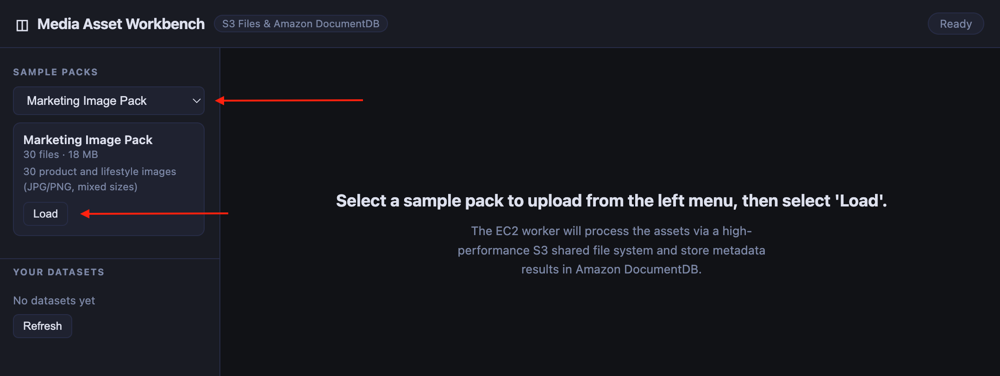
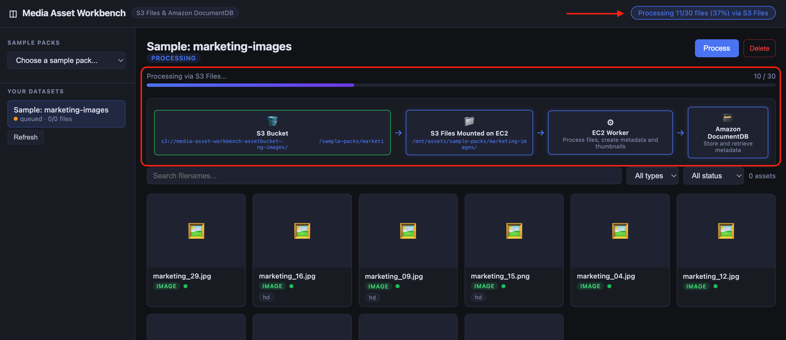
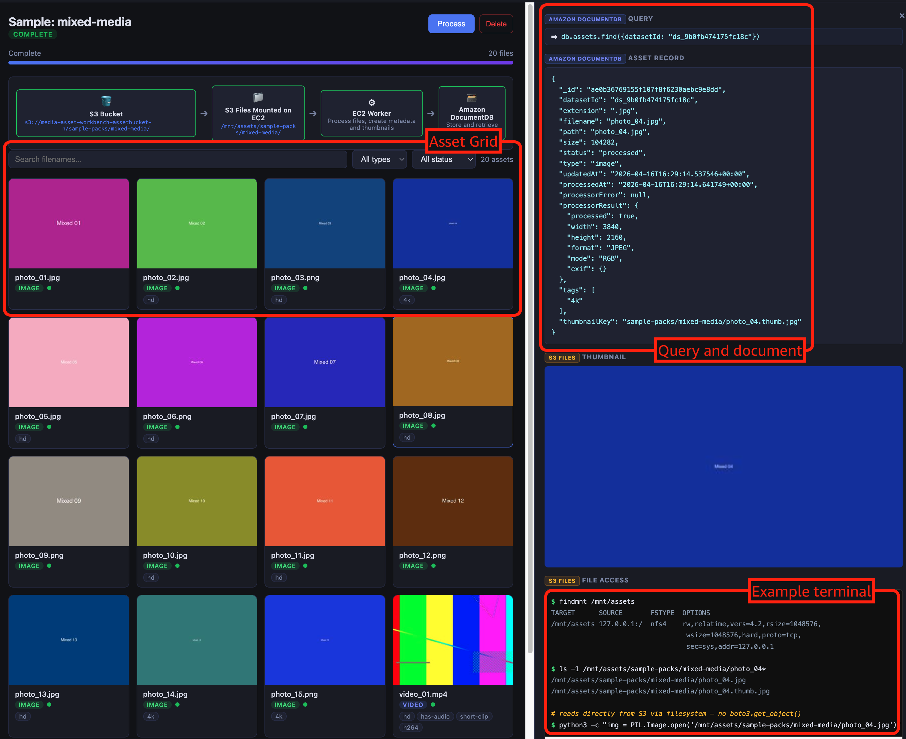

# Media Asset Workbench Sample

## Overview

A common enterprise use case on [Amazon DocumentDB](https://aws.amazon.com/documentdb/) is to store and index metadata for large objects kept in Amazon S3. This is a demo application that showcases [Amazon S3 Files](https://aws.amazon.com/s3/features/files/) working together with Amazon DocumentDB to build a media asset processing pipeline. Upload images and videos, process them through a mounted POSIX filesystem, and browse the results through a live-updating UI all backed by Amazon DocumentDB for metadata and S3 Files for file access.

**Key design elements**

- S3 Files mounts the Amazon S3 bucket as a local filesystem. The EC2 worker instance uses `os.walk()`, `PIL.Image.open()`, and `ffprobe` with **no S3 SDK calls** in the processing path
- Amazon DocumentDB stores the asset catalog, job state, tags, and metadata which drives the live UI through polling
- [AWS Secrets Manager](https://aws.amazon.com/secrets-manager/) auto-generates and stores Amazon DocumentDB credentials. No passwords in config files or environmental variables.
- Flexible schema — EXIF data, processor results, and tags stored as nested JSON documents
- Presigned URLs for secure thumbnail delivery are generated server-side and served to the browser.
- FastAPI serves both the REST API and static frontend from a single local process.
- [AWS Systems Manager Session Manager](https://docs.aws.amazon.com/systems-manager/latest/userguide/session-manager.html) port forwarding bridges the local server to the VPC-private DocumentDB cluster (no VPN or open inbound ports required).

## Architecture

```
┌─────────────────────────────────────────────────────────────────┐
│  Local machine                                                  │
│  ┌──────────────────────────────────┐                           │
│  │  Local UI  (FastAPI + static JS) │                           │
│  │  polls API every 2 seconds       │                           │
│  │  http://localhost:8080           │                           │
│  └──────────────┬───────────────────┘                           │
│                 │    pymongo (TLS, directConnection=true)       │
│                 │    via SSM port forward tunnel                │
└─────────────────│───────────────────────────────────────────────┘
                  │
                  ▼ localhost:27017
┌─────────────────────────────────────────────────────────────────┐
│  AWS                                                            │
│                                                                 │
│  EC2 instance (SSM Session Manager)                             │
│    │  port forwards localhost:27017                             │
│    │                                                            │
│    ├─► Amazon DocumentDB (VPC-private, TLS)                     │
│    │   (metadata, jobs, assets)                                 │
│    │    ▲                                                       │
│    │    └── AWS Secrets Manager (credentials)                   │
│    │                                                            │
│    └─► Amazon S3  ◄─── S3 Files (NFS mount at /mnt/assets)      │
│        (originals,      PIL, ffprobe                            │
│         thumbnails)     writes thumbnails back                  │
│                         polls database for jobs                 │
└─────────────────────────────────────────────────────────────────┘
```

**Why SSM port forwarding?**

Amazon DocumentDB is a [VPC-private service](https://docs.aws.amazon.com/documentdb/latest/developerguide/vpc-clusters.html) with no public endpoint. For this solution, the local FastAPI server connects directly to Amazon DocumentDB via an AWS Systems Manager Session Manager port forward tunnel through the EC2 worker instance. No VPN, no open inbound ports, no per-request Lambda overhead.

The `/etc/hosts` mapping (`127.0.0.1 <DOCDB_ENDPOINT>`) is required so that pymongo connects using the Amazon DocumentDB FQDN which allows TLS certificate verification to pass.

## Prerequisites

- [AWS CLI v2](https://github.com/aws/aws-cli) configured with deploy permissions
- Python 3.11+
- An Amazon EC2 key pair in your target region
- [ImageMagick](https://github.com/ImageMagick/ImageMagick) and [ffmpeg](https://github.com/ffmpeg/ffmpeg) (used for generating sample data)

## Installation

### Step 1 - Configure

```bash
cd media_asset_workbench
cp config.env.example config.env
```

Edit `config.env` and set:

- `KEY_PAIR_NAME` - the name of your EC2 key pair (**not** the `.pem` filename). For example, if your key file is `mykey.pem`, set `KEY_PAIR_NAME=mykey`. The key pair must already exist in your target region (check the Amazon EC2 console under **Key Pairs**).
- `MY_IP` — your public IP in CIDR notation with a `/32` suffix. Run this to get the value:

  ```bash
  echo "$(curl -s https://checkip.amazonaws.com)/32"
  ```
  
  Then paste the output, e.g. `MY_IP=1.2.3.4/32`.

### Step 2 - Deploy the stack

```bash
chmod +x deploy.sh
./deploy.sh
```

This deploys an [AWS CloudFormation](https://aws.amazon.com/cloudformation/) stack with: Amazon VPC, Amazon DocumentDB, AWS Secrets Manager, EC2 instance, Amazon S3 bucket, and VPC endpoints. `deploy.sh` writes all stack outputs back into `config.env` when complete and downloads the RDS CA bundle to the project root.

### Step 3 - Generate and upload sample data

```bash
chmod +x generate-sample-data.sh
./generate-sample-data.sh
aws s3 sync ./sample-data/ s3://YOUR_BUCKET/sample-packs/ --region us-east-1
```

Replace `YOUR_BUCKET` with the `BUCKET_NAME` value from `config.env` (written by `deploy.sh`).

### Step 4 - Set up S3 Files on the EC2 instance

Run this on your **local machine**. It sources `config.env` for all values and executes `userdata.sh` on the EC2 instance in a single SSH command — no interactive session needed.

SSH keys must have restricted permissions (SSH will refuse to connect if the key file is world-readable):

```bash
source config.env

# Key in ~/.ssh/:
chmod 400 ~/.ssh/${KEY_PAIR_NAME}.pem
ssh -i ~/.ssh/${KEY_PAIR_NAME}.pem ec2-user@${WORKER_IP} \
  "sudo BUCKET_NAME=${BUCKET_NAME} AWS_REGION=${AWS_REGION} \
   SUBNET_ID=${SUBNET_ID} SECURITY_GROUP_ID=${SECURITY_GROUP_ID} \
   S3FILES_ROLE_ARN=${S3FILES_ROLE_ARN} bash /opt/worker/userdata.sh"

# Key in project directory:
chmod 400 ./${KEY_PAIR_NAME}.pem
ssh -i ./${KEY_PAIR_NAME}.pem ec2-user@${WORKER_IP} \
  "sudo BUCKET_NAME=${BUCKET_NAME} AWS_REGION=${AWS_REGION} \
   SUBNET_ID=${SUBNET_ID} SECURITY_GROUP_ID=${SECURITY_GROUP_ID} \
   S3FILES_ROLE_ARN=${S3FILES_ROLE_ARN} bash /opt/worker/userdata.sh"
```

The script prints the results of `df -h` as a mount table and the `ls` output for `/mnt/assets` on completion. Confirm the setup succeeded before proceeding:

- The mount table should show `/mnt/assets` with source `127.0.0.1:/` and size `8.0E`
- The directory listing should include `sample-packs/` (uploaded in Step 3)

### Step 5 - Add the Amazon DocumentDB cluster endpoint to your local `/etc/hosts`

Run this on your **local machine**. It maps the Amazon DocumentDB cluster endpoint to `127.0.0.1` so pymongo's TLS certificate verification passes when connecting through the SSM tunnel.

```bash
# Replace <DOCDB_ENDPOINT> with the value from config.env
echo '127.0.0.1 <DOCDB_ENDPOINT>' | sudo tee -a /etc/hosts
```

**Note** - Remove this line when you tear down the stack.

### Step 6 - Open the SSM port forward tunnel on your local machine

Run this on your **local machine** in a dedicated terminal and keep it open while using the UI:

```bash
aws ssm start-session \
  --target <WORKER_INSTANCE_ID> \
  --document-name AWS-StartPortForwardingSessionToRemoteHost \
  --parameters 'host=<DOCDB_ENDPOINT>,portNumber=27017,localPortNumber=27017'
```

Both `WORKER_INSTANCE_ID` and `DOCDB_ENDPOINT` are in `config.env` after running `deploy.sh`.

This allows your local UI to connect with Amazon DocumentDB without the need for a bastion host. 

### Step 7 - Start the local UI

Run this on your **local machine** in a new terminal (Step 6's terminal must stay open for the SSM tunnel):

```bash
cd ui
pip install -r requirements.txt
uvicorn app:app --reload --port 8080
```

**Expected output:**

```
INFO:     Uvicorn running on http://127.0.0.1:8080 (Press CTRL+C to quit)
...
INFO:     Application startup complete.
```

Then open `http://127.0.0.1:8080` in your browser.

The web interface provides:
- **Sample Pack Loading** — select a pack from the dropdown, click `Load`, and watch the worker process files in real time



- **Live Processing Pipeline** — visual data flow showing Amazon S3 → S3 Files Mount → EC2 instance → Amazon DocumentDB as files are processed



- **Asset Grid with Filtering** — filter by type (image/video) and status, with the live Amazon DocumentDB query displayed
- **Asset Detail Panel** — thumbnail preview, metadata, auto-generated tags, the full Amazon DocumentDB document, and a terminal-style view of the S3 Files mount path



## Code structure

```
media_asset_workbench/
├── deploy.sh                    # Deploys the full CloudFormation stack
├── cleanup.sh                   # Tears down all resources
├── generate-sample-data.sh      # Generates synthetic sample media
├── config.env.example           # Config template (copy to config.env and fill in)
├── infrastructure/
│   └── cloudformation.yaml
├── worker/
│   ├── worker.py                # Job poller
│   ├── userdata.sh              # EC2 setup script
│   └── processors/
│       ├── __init__.py          # Asset type detection and routing
│       ├── image.py             # PIL-based image processing (EXIF, thumbnails)
│       └── video.py             # ffprobe metadata extraction, ffmpeg thumbnails
├── ui/
│   ├── app.py                   # FastAPI server (REST API + static files, connects to DocumentDB)
│   └── static/
│       ├── index.html           # Single-page app layout
│       ├── app.js               # Frontend logic
│       └── style.css
└──sample-data/                 # Generated sample packs (created by generate-sample-data.sh)
```

**Key components**

* **Local UI Server** (`ui/app.py`)

    - FastAPI serves both the REST API and the static single-page app from a single process
    - Connects directly to Amazon DocumentDB via the SSM port forward tunnel
    - Reads database credentials from AWS Secrets Manager at startup
    - Reads/writes Amazon DocumentDB for datasets, assets, and jobs
    - Creates indexes on first connection
    - Generates presigned Amazon S3 URLs for thumbnail delivery
    - Binds to `127.0.0.1`; not exposed to the local network

* **Worker** (`worker/worker.py`)

    - Polls Amazon DocumentDB for pending jobs, claims them atomically with `find_one_and_update`
    - Walks the S3 Files mount with `os.walk()`
    - Processes files with PIL/ffprobe, writes results back to Amazon DocumentDB
    - Writes `lastHeartbeatAt` on every file processed; any job stuck in `running` state beyond `STALE_JOB_TIMEOUT` seconds (default: 300) is automatically reset to `pending` and retried on the next poll cycle (*this is configurable with `STALE_JOB_TIMEOUT=<seconds>` in `/opt/worker/.env`*)

* **S3 Files Setup** (`worker/userdata.sh`)

    - Creates the S3 Files filesystem and mount target
    - Mounts at `/mnt/assets`

## Amazon DocumentDB collections

| Collection | Purpose |
|---|---|
| `datasets` | One record per uploaded/sample set. Holds status and stats |
| `assets` | One record per file. Holds path, tags, type, thumbnail key, processor output |
| `jobs` | Processing job state |

### Example document schema

```json
{
  "_id": ...,
  "datasetId": ...,
  "extension": ".jpg",
  "filename": "photo_04.jpg",
  "path": "photo_04.jpg",
  "size": 104282,
  "status": "processed",
  "type": "image",
  "updatedAt": ...,
  "processedAt": ...,
  "processorError": null,
  "processorResult": {
    "processed": true,
    "width": 3840,
    "height": 2160,
    "format": "JPEG",
    "mode": "RGB",
    "exif": {}
  },
  "tags": [
    "4k"
  ],
  "thumbnailKey": "sample-packs/mixed-media/photo_04.thumb.jpg"
}
```

- `datasetId` links assets to their parent dataset
- `tags` are auto-generated from EXIF data, resolution, codec, and duration
- `processorResult` varies by type — images have dimensions/EXIF, videos have duration/codec/fps
- `thumbnailKey` is the S3 key for the generated thumbnail

## Technical details

#### Amazon S3 and S3 Files

| Feature | Implementation |
|---|---|
| Public access block | All four block-public-access flags enabled — no object or bucket ACL can grant public access |
| Versioning | Enabled on the asset bucket — protects against accidental overwrites of originals and thumbnails |
| Lifecycle rule | `uploads/` prefix expires after 7 days — prevents unbounded growth from direct-upload workflows |
| CORS | Restricted to `http://localhost:8080` — presigned PUT and GET requests work from the local UI without exposing the bucket more broadly |
| S3 gateway VPC endpoint | S3 traffic from the EC2 worker stays on the AWS private network and never traverses the internet |
| Presigned URLs | Thumbnails are delivered via server-generated presigned URLs (1-hour expiry) — the bucket remains fully private and no credentials are passed to the browser |
| S3 Files POSIX access | The worker calls `os.walk()`, `PIL.Image.open()`, and `ffprobe` directly against `/mnt/assets` — zero `boto3` S3 calls in the processing hot path. Thumbnails written back to the mount appear in S3 automatically |
| S3FilesRole trust policy | Scoped with `aws:SourceAccount` and `aws:SourceArn` conditions — the role can only be assumed by the S3 Files service acting on this account's filesystem, not any EFS principal |

#### Amazon DocumentDB

| Feature | Implementation |
|---|---|
| TLS enforced | TLS is on by default for Amazon DocumentDB; the worker and UI both connect with `tlsCAFile` pointing to the RDS CA bundle |
| Credentials in Secrets Manager | `GenerateSecretString` auto-generates a 32-character alphanumeric password at stack creation with no password ever appearing in config files or code |
| Atomic job claiming | `find_one_and_update` with `sort` ensures exactly one worker claims each job even under concurrent load. No separate locking collection or advisory lock needed |
| Compound indexes | Indexes on `(datasetId, status)`, `(datasetId, type)`, and `(datasetId, path)` match the actual query patterns. Filters applied in the UI hit indexes rather than scanning the collection |
| Connection pooling | `MongoClient` is a module-level singleton in both the worker and UI. The driver's internal connection pool is reused across all requests and jobs rather than reconnected per operation |
| Stale job recovery | The worker stamps `lastHeartbeatAt` on every file processed and resets any `running` job older than `STALE_JOB_TIMEOUT` (default 300 s) back to `pending` |
| Flexible schema | `processorResult` stores image EXIF/dimensions or video codec/fps/duration depending on asset type. A relational dataabase schema would require separate tables or nullable columns for each media type |

#### Security

| Feature | Implementation |
|---|---|
| No public endpoint | The Amazon DocumentDB cluster has no internet-facing endpoint; it is only reachable within the VPC. Local access is via SSM Session Manager port forwarding (no VPN, no bastion, no open inbound ports) |
| SSM over SSH | The EC2 instance carries `AmazonSSMManagedInstanceCore`. Session Manager tunnelling works without the SSH port being open to the internet. The SSH inbound rule in `WorkerSG` is restricted to a single IP (`MyIP`) for direct access if needed |
| Least-privilege IAM | `WorkerRole` grants only the specific S3 actions needed (`GetObject`, `PutObject`, `ListBucket`, `DeleteObject`) on the specific bucket ARN. `SecretManagerGetSecretValue` is scoped to the specific secret ARN, not `*` |
| Separate mount target security group | `MountTargetSG` allows NFS (port 2049) only from `WorkerSG`. The NFS endpoint is not reachable from any other source inside or outside the VPC |
| Local server not network-exposed | The FastAPI UI server binds to `127.0.0.1` only and is not accessible from other machines on the local network |

## Cost

| Service | Config | Estimated cost |
|---|---|---|
| Amazon DocumentDB | db.t3.medium × 1, **stopped when idle** | ~$0.08/hr running* |
| Amazon EC2 Worker | t3.small, stop when not demoing | ~$0.023/hr running |
| Amazon S3 | Small datasets (<1 GB) | ~$0 |
| AWS Secrets Manager | 1 secret | ~$0.40/mo |

 **[Free trial elibigle](https://aws.amazon.com/documentdb/pricing/#:~:text=Started%20guide.-,Free%20trial,-If%20you%20are)*

#### Stop / resume

To save on costs, you can [stop the Amazon DocumentDB cluster](https://docs.aws.amazon.com/documentdb/latest/developerguide/db-cluster-stop-start.html) and the EC2 instance when not demoing.

```bash
# Stop
aws docdb stop-db-cluster --db-cluster-identifier media-asset-workbench-docdb --region us-east-1
aws ec2 stop-instances --instance-ids i-xxxxxxxxxxxxxxxxx --region us-east-1

# Resume
aws docdb start-db-cluster --db-cluster-identifier media-asset-workbench-docdb --region us-east-1
aws ec2 start-instances --instance-ids i-xxxxxxxxxxxxxxxxx --region us-east-1
```

## Tear down

First, stop the two local processes:

- **Step 6 terminal** (SSM tunnel) — press `CTRL+C` to close the port forward session
- **Step 7 terminal** (uvicorn) — press `CTRL+C` to stop the UI server

Then run cleanup, which gathers all resource names from `config.env`:

```bash
./cleanup.sh
```

* Empties the versioned Amazon S3 bucket
* Deletes the S3 Files filesystem
* Deletes the AWS CloudFormation stack
* Removes the deployment bucket

Then remove the `/etc/hosts` line you added in Step 5:

```bash
# macOS
source config.env && sudo sed -i '' "/${DOCDB_ENDPOINT}/d" /etc/hosts

# Linux
source config.env && sudo sed -i "/${DOCDB_ENDPOINT}/d" /etc/hosts
```
