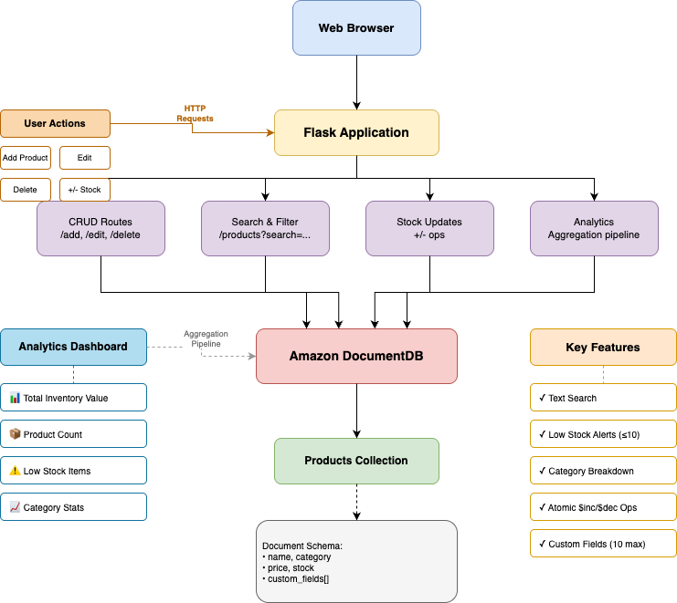

# Product Catalog Sample

## Overview

This is an example of an interactive web-based product catalog with Amazon DocumentDB using Python and Flask. It showcases CRUD operations, cursor-based pagination, aggregation analytics, text search, and flexible schema design with custom fields.

**Key design elements**

- Secure connection setup with TLS and retry logic for transient failures
- Indexes matched to query patterns (unique, single-field, text search)
- Atomic operations for concurrent-safe stock updates using `$inc`
- Cursor-based pagination for efficient large dataset handling
- Aggregation pipelines for real-time analytics
- Flexible schema with custom fieldss
- Connection pooling and singleton pattern for resource efficiency
- Error handling and validation



## Prerequisites

- Python 3.10+
- Amazon DocumentDB cluster ([Getting Started Guide](https://docs.aws.amazon.com/documentdb/latest/developerguide/get-started-guide.html))
- Amazon DocumentDB CA certificate:

```bash
wget https://truststore.pki.rds.amazonaws.com/global/global-bundle.pem
```

## Installation

```bash
pip install -r requirements.txt
```

## Network Connectivity

Amazon DocumentDB is a VPC-only service with no public endpoints. This demo requires that the Flask application have network access to your cluster. Common approaches:

- **Configure an SSH tunnel** — From your local machine, set up an SSH tunnel through an [EC2 bastion host](https://repost.aws/knowledge-center/documentdb-ec2-bastion-host-ssh):
  ```bash
  ssh -i path_to_pem_file -L local-port:cluster-endpoint:remote-port instance-user-name@instance-public-dns-name -N -f
  ```
  Replace the followiong:

  | Variable | Replacement Value |
  |---|---|
  | path_to_pem_file | EC2 instance private key file |
  | local-port | Port number you want to use on your local machine |
  | cluster-endpoint | Amazon DocumentDB cluster endpoint |
  | remote-port | Amazon DocumentDB cluster port (e.g. `27017`) |
  | instance-user-name | EC2 instance user (e.g. `ec2-user`) |
  | instance-public-dns-name | Public name or IP address of EC2 bastion host |

  In the following example, the SSH tunnel binds port `27017` of the local machine to the remote Amazon DocumentDB cluster:
  ```bash
  ssh -i "ec2Access.pem" -L 27017:sample-cluster.node.us-east-1.docdb.amazonaws.com:27017 ec2-user@ec2-zz-aaa-yyy-zzz.compute-1.amazonaws.com -N -f
  ```
  Then set `DOCDB_HOST=localhost` to connect through the tunnel.

- **EC2 instance in the same VPC** — Launch an EC2 instance in a subnet that has security group access to the Amazon DocumentDB cluster, then run the sample there. Access the Flask web interface from your local browser at `http://<ec2-public-ip>:5000` (ensure the EC2 security group allows inbound traffic on port `5000`).
- **VPN conenction or AWS Direct Connect** — Utilize a virtual interface or [AWS Client VPN](https://aws.amazon.com/blogs/database/securely-access-amazon-documentdb-with-mongodb-compatibility-locally-using-aws-client-vpn/)

For more details, see [Connecting to an Amazon DocumentDB Cluster from Outside an Amazon VPC](https://docs.aws.amazon.com/documentdb/latest/developerguide/connect-from-outside-a-vpc.html).

## Configuration

Set the following environment variables before running:

| Variable | Required | Default | Description |
|---|---|---|---|
| `DOCDB_HOST` | Y | — | DocumentDB cluster endpoint |
| `DOCDB_PORT` | N | `27017` | Connection port |
| `DOCDB_USERNAME` | Y | — | Database username |
| `DOCDB_PASSWORD` | Y | — | Database password |
| `DOCDB_TLS_CA` | Y | — | Path to CA certificate (`global-bundle.pem`) |

**Linux/macOS:**

```bash
export DOCDB_HOST="your-cluster.cluster-xxxx.us-east-1.docdb.amazonaws.com"
export DOCDB_PORT="27017"
export DOCDB_USERNAME="your-username"
export DOCDB_PASSWORD="your-password"
export DOCDB_TLS_CA="./global-bundle.pem"
```

**Windows PowerShell:**

```powershell
$env:DOCDB_HOST="your-cluster.cluster-xxxx.us-east-1.docdb.amazonaws.com"
$env:DOCDB_PORT="27017"
$env:DOCDB_USERNAME="your-username"
$env:DOCDB_PASSWORD="your-password"
$env:DOCDB_TLS_CA=".\global-bundle.pem"
```

## Running the Sample

```bash
python app.py
```

Then open your browser to `http://localhost:5000`

The web interface provides:
- **Interactive Product Management** - Add, edit, delete products with inline forms
- **Real-time Analytics Dashboard** - Total inventory value, product count, low stock alerts (≤10 items), category breakdown
- **Advanced Filtering** - Category dropdown and text search with debouncing
- **Atomic Stock Updates** - Increment/decrement stock with race condition prevention
- **Custom Fields** - Add up to 10 custom key-value pairs per product

**Expected output:**

```
2026-03-04 08:00:00,123 [INFO] __main__ – Connected to DocumentDB
2026-03-04 08:00:00,234 [INFO] __main__ – Indexes ensured on collection 'products'.
2026-03-04 08:00:00,345 [INFO] __main__ – Seeding database with sample products...
2026-03-04 08:00:00,456 [INFO] __main__ – Inserted 25 sample products
 * Serving Flask app 'app'
 * Debug mode: on
 * Running on http://127.0.0.1:5000
```

Open your browser to the URL shown and interact with the product catalog.

## Code Structure

```
example/
├── app.py                 # Flask application with API endpoints
├── templates/
│   └── index.html         # Interactive web interface
├── seed_data.csv          # 25 sample products
├── requirements.txt       # Python dependencies
└── README.md              # This file
```

**Key Components:**

1. **Connection Management** (`get_client`) - Singleton pattern with retry logic
2. **Index Setup** (`ensure_indexes`) - Creates indexes on startup
3. **API Endpoints**:
   - `GET /` - Main web interface
   - `GET /api/products` - List products (with pagination, filtering, search)
   - `POST /api/products` - Add product
   - `PUT /api/products/<sku>` - Update product
   - `PUT /api/products/<sku>/stock` - Update stock atomically
   - `DELETE /api/products/<sku>` - Delete product
   - `GET /api/analytics` - Aggregation analytics
4. **Data Seeding** - Automatically loads 25 sample products on first run

## Document Schema

```json
{
  "sku": "LAPTOP-001",
  "name": "Pro Laptop 15",
  "category": "Electronics",
  "price": 1299.99,
  "stock": 15,
  "description": {
    "RAM": "16GB",
    "CPU": "2.4GHz",
    "Storage": "512GB SSD"
  }
}
```

**Notes:**
- `sku` is unique (enforced by index)
- `description` is optional and can contain 0-10 custom fields
- This is a **demo/sample application** and includes trade-offs for developer convenience:

  - **Debug mode** - Flask runs with `debug=True` to enable auto-reload and the interactive debugger. This should be disabled in non-demo environments to prevent arbitrary code execution.
  - **Error handling** - Exception messages are sanitized to avoid leaking internal details. If you modify error handling, avoid returning raw exception strings to clients.
  - **Credentials** - Store database credentials in [AWS Secrets Manager](https://docs.aws.amazon.com/documentdb/latest/developerguide/docdb-secrets-manager.html) rather than environment variables for production deployments.
