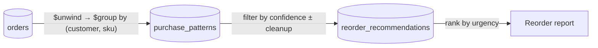

# Retail Replenishment Pattern Detection

> This sample demonstrates how to mine order history for recurring purchase patterns with Amazon DocumentDB using Python, turning them into a ranked list of customers who are due - or overdue - for a reorder.

## Overview

Retailers selling consumables (pet food, vitamins, coffee, contact lenses) depend on repeat purchases. Customers run out on a fairly predictable cadence, but most storefronts only react *after* a reorder arrives instead of predicting it. The customer who quietly stopped buying dog food six weeks ago is the one about to churn to a subscription competitor, and nothing in a typical order table surfaces that.

This sample analyzes order history per `(customer, SKU)` pair to find how often each item is actually bought and how reliable that cadence is, then classifies every pair as `overdue`, `due_now`, or `upcoming`. The grouping runs as a DocumentDB aggregation pipeline, so the application receives one row per customer/SKU pair rather than the entire order history.

**What you'll learn:**

- Running analytical grouping as a **server-side aggregation pipeline** instead of pulling a collection into application memory
- Making derived data **idempotent with deterministic `_id` values**, so scheduled re-runs replace results rather than duplicate them
- Creating appropriate indexes to match query patterns in application code

### How the data flows



### Files

```text
.
├── main.py            # Pipeline: connect, seed, detect, recommend, report
├── api.py             # REST API for consuming recommendations
├── requirements.txt
├── LICENSE
├── .gitignore
└── README.md
```

## Prerequisites

- Python 3.11+
- Amazon DocumentDB cluster ([Getting Started Guide](https://docs.aws.amazon.com/documentdb/latest/developerguide/get-started-guide.html))
- Amazon DocumentDB CA certificate:

```bash
wget https://truststore.pki.rds.amazonaws.com/global/global-bundle.pem
```

## Installation

```bash
pip install -r requirements.txt
```

## Configuration


> **This sample reads credentials from environment variables to keep it easy to run. That is fine for a proof of concept on a throwaway cluster - but it is not how you should handle credentials in production.**
>
> Environment variables leak: they land in shell history, appear in `ps` and `/proc/<pid>/environ`, get captured in container inspect output and CI logs, and are visible to every process in the same session. For anything beyond evaluation, load credentials at startup from **[AWS Secrets Manager](https://docs.aws.amazon.com/secretsmanager/latest/userguide/intro.html)** (which also gives you automatic rotation for DocumentDB) or an **[SSM Parameter Store `SecureString`](https://docs.aws.amazon.com/systems-manager/latest/userguide/parameter-store-securestring.html)**, and grant the runtime's IAM role read access to just that one secret. See [Taking This to Production](#taking-this-to-production).

Set the following environment variables before running:

| Variable | Required | Default | Description |
|---|---|---|---|
| `DOCDB_URI` | Y | - | Full connection string (includes host, port, credentials, TLS, and read preference) |
| `DOCDB_DATABASE` | N | `replenishment` | Target database name |
| `CONFIDENCE_THRESHOLD` | N | `0.4` | Minimum pattern confidence required to produce a recommendation |
| `API_PORT` | N | `8080` | Port for the REST API (`api.py`) |

**Linux/macOS:**

```bash
export DOCDB_URI="mongodb://<user>:<pass>@your-cluster.cluster-xxxx.us-east-1.docdb.amazonaws.com:27017/?tls=true&tlsCAFile=global-bundle.pem&retryWrites=false&readPreference=secondaryPreferred"
```

**Windows PowerShell:**

```powershell
$env:DOCDB_URI="mongodb://<user>:<pass>@your-cluster.cluster-xxxx.us-east-1.docdb.amazonaws.com:27017/?tls=true&tlsCAFile=global-bundle.pem&retryWrites=false&readPreference=secondaryPreferred"
```

**Pulling the URI from Secrets Manager instead**, which is the better habit even for a PoC:

```bash
export DOCDB_URI="$(aws secretsmanager get-secret-value \
  --secret-id my-docdb-uri \
  --query 'SecretString' --output text)"
```

In production, do this fetch *inside* the application at startup rather than in the shell, so the plaintext never becomes an environment variable at all.

## Running the Sample

```bash
python main.py
```

The pipeline pauses between stages with an explanation of what is about to happen. Press Enter to advance. To run without pauses (e.g., in automation):

```bash
python main.py --no-pause
```

**Expected output:**

```
[TIMESTAMP] [INFO] Connected to Amazon DocumentDB (database=replenishment)
[TIMESTAMP] [INFO] Indexes ready
[TIMESTAMP] [INFO] Seeded customers=12 products=18 orders=270
[TIMESTAMP] [INFO] Detected 36 purchase patterns
[TIMESTAMP] [INFO] Generated 25 reorder recommendations

==========================================================================
 TOP PURCHASE PATTERNS BY CONFIDENCE (showing 15)
==========================================================================
CUSTOMER    SKU                           BUYS     EVERY    CONF
--------------------------------------------------------------------------
CUST-0005   SKU-PERSONALCARE-017            10       21d    0.96
CUST-0004   SKU-PERSONALCARE-016            15       14d    0.95
CUST-0010   SKU-PETFOOD-002                 14       14d    0.94
...
==========================================================================
 REORDER RECOMMENDATIONS, MOST URGENT FIRST (showing 15)
==========================================================================
URGENCY    CUSTOMER    SKU                                  DUE    CONF
--------------------------------------------------------------------------
overdue    CUST-0007   SKU-GROCERIES-013             2026-06-30    0.48
overdue    CUST-0006   SKU-CLEANING-009              2026-07-04    0.50
overdue    CUST-0012   SKU-PERSONALCARE-018          2026-07-26    0.94
...
--------------------------------------------------------------------------
 Totals: 11 overdue | 2 due now | 12 upcoming

[TIMESTAMP] [INFO] Sample complete.
```

The script is safe to re-run - each run starts fresh with clean data. Exact counts and dates shift with the current date, since the seeded order history is generated relative to today.

## Serving Recommendations (API)

After running the pipeline, start the REST API to query recommendations:

```bash
python api.py
```

**Endpoints:**

| Method | Path | Description |
| --- | --- | --- |
| GET | `/recommendations` | All recommendations, most urgent first |
| GET | `/recommendations?urgency=overdue` | Filter by urgency status |
| GET | `/recommendations?limit=10` | Limit results (max 200) |
| GET | `/recommendations/<customer_id>` | Recommendations for one customer |
| GET | `/patterns/<customer_id>` | Detected patterns for one customer |
| GET | `/health` | Connection health check |

In a separate terminal, you can test the endpoints similar to below:

```bash
# Verify endpoint is healthy ("status": "ok")
curl -s http://localhost:8080/health | python -m json.tool

# Retreive sample recommendations
curl -s http://localhost:8080/recommendations?limit=2 | python -m json.tool
```

#### Example response

```json
[
    {
        "confidence": 0.9403,
        "customer_id": "CUST-0010",
        "next_expected_reorder_date": "2026-08-21T00:00:00",
        "sku": "SKU-PETFOOD-002",
        "urgency_status": "due_now"
    },
    {
        "confidence": 0.6776,
        "customer_id": "CUST-0005",
        "next_expected_reorder_date": "2026-08-23T00:00:00",
        "sku": "SKU-GROCERIES-014",
        "urgency_status": "due_now"
    }
]
```

Exact values and dates depend on when you run the pipeline, since the seeded order history is generated relative to today.

The API reads from the same collections the pipeline writes to. Each endpoint uses projections and the indexes created by `main.py`, so reads are efficient at any scale.

## Cleanup

When you are finished with the demo, remove all sample data from the cluster:

```bash
python api.py --cleanup
```

or equivalently:

```bash
python main.py --cleanup
```

This drops all six collections created by the sample, leaving no documents, indexes, or metadata behind.

## How It Works

**1. Seed** - Generates 12 customers, 18 products, and roughly 200 days of order history from a fixed PRNG seed, so the data is identical on every machine. Each customer buys 2–4 products on a recurring cadence with a day of jitter, plus a few one-off orders that stay below the observation floor and are correctly ignored. About a third of the recurring series stop before today; those become the `overdue` rows.

**2. Detect** - Runs an aggregation pipeline built by `_build_pipeline()`. `$unwind` explodes each order's line items, `$group` collects every purchase date per `(customer_id, sku)`, and `$match` drops pairs bought fewer than three times. Aggregation results are processed in batches - in incremental mode, each batch fetches existing patterns with a single `$in` query on `_id` (one round-trip per batch, not per document). For each surviving pair the code computes the mean gap between purchases, its standard deviation, and a confidence score:

```
confidence = min(1, buys / 10) × (1 − min(1, stddev / mean))
             └── evidence ──┘     └────── stability ──────┘
```

A customer who has bought the same item ten times, every 21 days like clockwork, scores near `1.0`. One who bought three times at wildly uneven intervals scores near `0.0`. Results are written to `purchase_patterns` with `_id = "{customer_id}:{sku}"`. When a pattern's confidence drops below the threshold, its corresponding recommendation is deleted immediately - a targeted point delete on the shared `_id`.

**3. Recommend** - Reads patterns at or above `CONFIDENCE_THRESHOLD`, projects only the five fields it needs, and computes the next expected reorder date as `last_purchase_date + average_interval_days`. Comparing that date to today yields the urgency label:

| Label | Condition |
|---|---|
| `overdue` | more than 2 days past the expected date |
| `due_now` | within 3 days before through 2 days after |
| `upcoming` | more than 3 days out |

**4. Report** - Prints the highest-confidence patterns and the reorder list, most urgent first. The recommendations are read in expected-date order (served by the compound index) and ranked by urgency in Python, because a server-side sort on `urgency_status` would order the labels alphabetically - `due_now`, `overdue`, `upcoming` - which is not the priority order you want.

## Data Model

Six collections. All dates are BSON dates.

**`orders`** - the input. Line items are embedded because they are always read and written with their parent order, there are only a handful per order, and nothing queries them independently.

```json
{
  "order_id": "ORD-000001",
  "customer_id": "CUST-0001",
  "order_date": "ISODate('2026-08-03T00:00:00Z')",
  "line_items": [
    { "sku": "SKU-PETFOOD-001", "quantity": 1, "unit_price": 42.99 },
    { "sku": "SKU-SUPPLEMENTS-005", "quantity": 2, "unit_price": 19.99 }
  ]
}
```

**`purchase_patterns`** - one document per recurring `(customer, SKU)` pair, written by the detector.

```json
{
  "_id": "CUST-0001:SKU-PETFOOD-001",
  "customer_id": "CUST-0001",
  "sku": "SKU-PETFOOD-001",
  "observation_count": 10,
  "average_interval_days": 20.9,
  "interval_stddev_days": 0.83,
  "confidence": 0.96,
  "last_purchase_date": "ISODate('2026-08-03T00:00:00Z')",
  "computed_at": "ISODate('2026-08-20T10:02:52Z')"
}
```

**`reorder_recommendations`** - the actionable output.

```json
{
  "_id": "CUST-0001:SKU-PETFOOD-001",
  "customer_id": "CUST-0001",
  "sku": "SKU-PETFOOD-001",
  "next_expected_reorder_date": "ISODate('2026-08-24T00:00:00Z')",
  "urgency_status": "upcoming",
  "confidence": 0.96,
  "generated_at": "ISODate('2026-08-20T10:02:52Z')"
}
```

Both derived collections key on the deterministic composite `_id` `"{customer_id}:{sku}"`, which is what makes re-runs replace rather than accumulate.

**`customers`** and **`products`** hold the reference data the report reads (`customer_id`, `name`, `email`; `sku`, `name`, `category`, `unit_price`, `typical_reorder_days`).

**`checkpoints`** - stores the timestamp of the last successful detection run, enabling incremental processing on subsequent invocations.

## Best Practices Demonstrated

Grouped by [AWS Well-Architected Framework](https://aws.amazon.com/architecture/well-architected/) pillar. Everything listed here is actually implemented in `main.py` - see [Taking This to Production](#taking-this-to-production) for what a production deployment would add on top.

**Security**

- Credentials loaded from environment variables - never hardcoded
- TLS enforced with CA certificate validation on every connection

**Reliability**

- Connection verified with `ping` before any real work
- `retryWrites=False` set explicitly (DocumentDB requirement)
- Bounded `serverSelectionTimeoutMS` so a bad endpoint fails fast
- Client closed in a `finally` block
- All required configuration validated up front

**Performance**

- Grouping pushed into an aggregation pipeline; the application never loads all orders
- Batched reads in incremental mode: one `$in` query per batch instead of one `find_one` per document
- Indexes created once at startup, each matching a query this code issues
- Projections on reads so only the needed fields cross the wire
- Bounded reads with `.limit()`
- Batched bulk writes that flush every N operations, staying within the 16 MB wire-protocol limit
- Targeted point deletes on state change instead of bulk reconciliation scans
- A single `MongoClient` per process, with its connection pool sized explicitly

**Operations**

- Structured logging with timestamps and levels via the `logging` module
- Idempotent throughout: index creation, seeding, and both write steps are safe to re-run

**Cost**

- `$setOnInsert` and `$set` upserts avoid read-modify-write round-trips
- Batched bulk writes instead of a write per document
- Projections and bounded reads reduce I/O and data transfer

## Anti-Patterns to Avoid

| Anti-Pattern | Why It's Harmful | Correct Approach |
|---|---|---|
| `tlsAllowInvalidCertificates=True` | Disables certificate validation; exposes to MITM attacks | Always provide `tlsCAFile` |
| Hardcoded credentials | Security risk; breaks credential rotation | Use environment variables or AWS Secrets Manager |
| `retryWrites=True` | Not supported by DocumentDB; causes runtime errors | Set `retryWrites=False` |
| No indexes on queried fields | Full collection scans; high latency and I/O cost | Create indexes matching your access patterns |
| Creating indexes in loop or request bodies | Adds latency to every operation; races concurrent builds | Create indexes once at startup |
| Unbounded `find()` queries | Can return millions of documents | Use `.limit()` and paginate |
| Aggregating in application code | Memory and network cost grows with the whole dataset | Push grouping into an aggregation pipeline |
| Auto-generated `_id` on derived data | Re-runs duplicate instead of replace | Derive a deterministic `_id` from the business key |
| Read-modify-write for counters | Race conditions under concurrent load | Use `$inc`, `$set`, `$setOnInsert` atomic operators |
| `print()` for diagnostics | No levels or timestamps; hard to filter in CloudWatch | Use the `logging` module |

---

## Taking This to Production

This sample is deliberately stripped down to make the DocumentDB use case easy to read. It is **not** production-ready, and it does not pretend to satisfy the [AWS Well-Architected Framework](https://docs.aws.amazon.com/wellarchitected/latest/framework/definitions.html). The checklist below is a reference for what you would add, organised by the framework's six pillars. Nothing in this section is implemented here.

### Security

The sample enforces TLS with CA validation, keeps credentials out of source, and never disables certificate checks. For production, add:

- **Secrets Manager or SSM Parameter Store `SecureString`** for the cluster credentials, fetched by the application at startup rather than passed in as environment variables. Secrets Manager supports [managed rotation for DocumentDB](https://docs.aws.amazon.com/secretsmanager/latest/userguide/rotate-secrets_managed.html).
- **IAM authentication** to DocumentDB where available, removing the static password entirely.
- **Least-privilege IAM** on the runtime role: read on the one secret, and nothing broader.
- **Encryption at rest** with a customer-managed KMS key, so you control the key policy and rotation.
- **Network isolation**: cluster not publicly accessible, in private subnets, with a security group that admits only the application's security group on 27017 - not a CIDR range.
- **Auditing**: enable the DocumentDB [audit log and profiler](https://docs.aws.amazon.com/documentdb/latest/developerguide/event-auditing.html) exported to CloudWatch Logs.
- **Separate database users per workload**, so the analytics job cannot write to collections it only needs to read.

### Reliability

The sample pings before use, sets `retryWrites=False`, bounds server selection, and closes its client. For production, add:

- **Multi-AZ deployment** with at least one replica, and connect via the reader endpoint for read-only work.
- **Retry with exponential backoff and jitter** around transient failures. Because `retryWrites=False` is mandatory on DocumentDB, retries are the application's responsibility - and every write here is an idempotent upsert on a deterministic `_id`, which is what makes retrying safe.
- **Per-record error isolation** so a single malformed document does not abort a whole run.
- **Backups**: verified automated snapshot retention plus a tested restore procedure, not just enabled backups.
- **Idempotent, resumable batch runs** with checkpointing for histories too large for one pass.
- **Failure alarms** on job completion, not just on infrastructure health.

### Operational Excellence

The sample logs through the `logging` module with timestamps and levels, and every step is safe to re-run. For production, add:

- **Structured JSON logging** with correlation IDs, so CloudWatch Logs Insights can query fields instead of parsing prose.
- **Scheduled execution** via EventBridge Scheduler plus Lambda, ECS, or Batch, rather than a person running a script.
- **Metrics and dashboards**: patterns detected per run, recommendations by urgency, run duration, failure rate.
- **Alarms** on cluster CPU, connection count, replica lag, and low free storage.
- **Infrastructure as code** for the cluster, networking, and schedule.
- **Schema and index migrations** applied deliberately, not by an `ensure_indexes` call on every start. Build indexes in the background on large collections.
- **Runbooks** for the failure modes you expect to page on.

### Performance Efficiency

The sample pushes grouping into an aggregation pipeline, creates indexes once at startup, projects on reads, and bounds them with `limit()`. For production, add:

- **`explain()` on every query** against production-scale data to confirm indexes are used rather than assumed.
- **Reader endpoint** for the analytical pipeline so it does not compete with transactional traffic on the writer.
- **Right-sized instances**, informed by Performance Insights rather than guessed.
- **Load testing** at realistic cardinality - the cost driver is the number of distinct `(customer, SKU)` pairs, not the order count.

### Cost Optimization

The sample uses one pooled client, atomic upserts instead of read-modify-write, bulk writes, and bounded projected reads. For production, add:

- **Right-sized instances** with auto-scaling on replicas, or **DocumentDB Serverless** for spiky analytical workloads.
- **Reserved instances** for steady-state baseline capacity.
- **A TTL index** to expire stale recommendations rather than retaining them indefinitely.
- **Cost allocation tags** on the cluster so spend maps to the team that owns it.
- **Right-sized run cadence**: hourly detection on data that changes daily is wasted spend.
- **Storage growth monitoring**, since DocumentDB storage bills on high-water mark.

### Sustainability

Not addressed in the sample at all. For production, consider:

- **Run only when the data changed**, ideally driven by [change streams](https://docs.aws.amazon.com/documentdb/latest/developerguide/change_streams.html) rather than a fixed schedule.
- **Regions with lower carbon intensity**, where latency and data residency allow.
- **Data lifecycle policies** so you are not indefinitely storing and re-scanning order history nobody queries.

---

## Next Steps

- [AWS Secrets Manager](https://docs.aws.amazon.com/secretsmanager/latest/userguide/intro.html) - replace the plaintext credential variables with a secret fetched at startup
- [AWS Lambda + EventBridge Scheduler](https://docs.aws.amazon.com/scheduler/latest/UserGuide/what-is-scheduler.html) - run detection on a schedule instead of by hand
- [Amazon SNS](https://docs.aws.amazon.com/sns/latest/dg/welcome.html) - notify a customer or CRM when a recommendation turns `overdue`
- [DocumentDB Change Streams](https://docs.aws.amazon.com/documentdb/latest/developerguide/change_streams.html) - react to new orders as they arrive rather than on a fixed cadence
- [amazon-documentdb-samples Repository](https://github.com/aws-samples/amazon-documentdb-samples)

---

## Resources

- [Amazon DocumentDB Developer Guide](https://docs.aws.amazon.com/documentdb/latest/developerguide/)
- [Connecting Programmatically to Amazon DocumentDB](https://docs.aws.amazon.com/documentdb/latest/developerguide/connect_programmatically.html)
- [Supported MongoDB APIs and Aggregation Operators](https://docs.aws.amazon.com/documentdb/latest/developerguide/mongo-apis.html)
- [PyMongo Documentation](https://pymongo.readthedocs.io/)
- [AWS Well-Architected Framework](https://aws.amazon.com/architecture/well-architected/)

---

## Disclaimer

This sample is provided for demonstration purposes and is not intended for production use as-is. Review the security, networking, and operational configuration against your own requirements before deploying.
